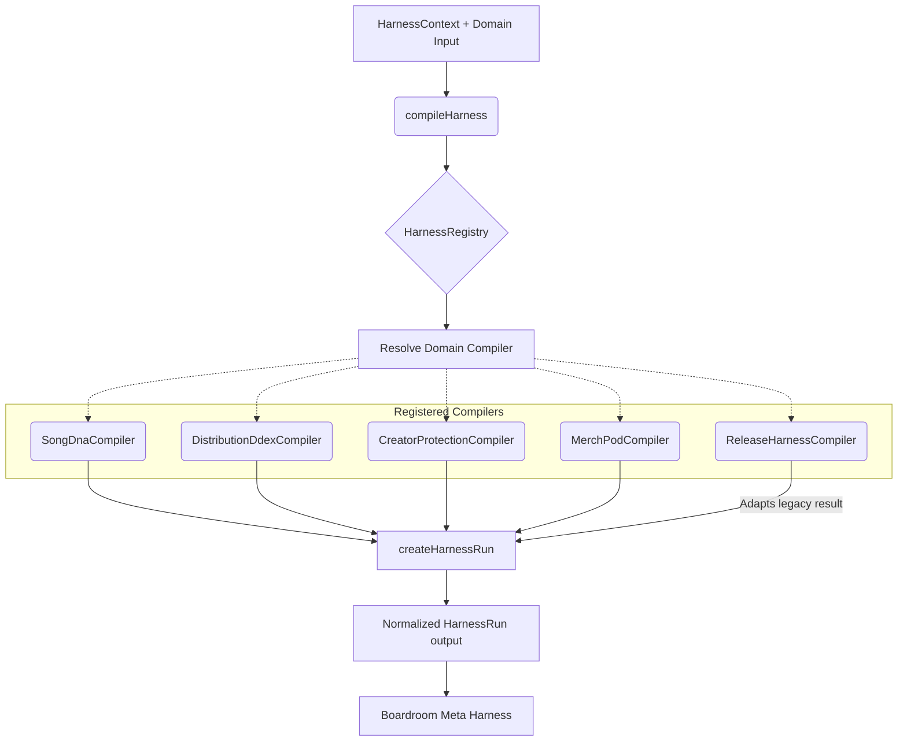

# Business Harness Wave 1 Architecture

This diagram illustrates the core rails architecture for the Business Harness implemented in Wave 1. It shows how the unified `HarnessCompiler` interface and `HarnessRegistry` replace ad-hoc implementations, allowing orchestrators like Upload Intake and Boardroom to uniformly invoke and consume results.

## Description
- **HarnessContext**: Standardized context containing `userId`, `projectId`, and `save` intent.
- **compileHarness / HarnessRegistry**: The single entrypoint for executing business checks. Every domain must register a compiler here.
- **Registered Compilers**: Existing domains have been refactored or adapted into discrete compilers to honor the `HarnessCompiler` interface.
- **Normalized Output**: Every compiler uses `createHarnessRun` to ensure standardized scoring, findings, recommendations, and agent briefs. Boardroom uses this unified shape to evaluate business impacts.
