# Button Action & Navigation Flowchart

Comprehensive flow mapping interactive button surfaces across indii.music through state handlers and store mutations to their terminal destinations, incorporating the redundancy elimination refactor.

```mermaid
flowchart TD
    subgraph UI_Surfaces ["1. UI Entry Surfaces"]
        direction TB
        subgraph GlobalShell ["Global Shell & Navigation"]
            B1["return-hq-btn"]
            B2["sidebar-toggle"]
            B3["sidebar-biometric-toggle"]
            B4["sidebar-command-menu-trigger"]
            B5["sidebar-agent-canvas-toggle"]
            B6["boardroom-mode-toggle"]
            B7["founders-checkout-button"]
            B8["nav-item-items"]
        end

        subgraph CommandBarSurfaces ["Command Bar & Prompts"]
            C1["talk-button Idle"]
            C2["command-bar-stop-btn Busy"]
            C3["knowledge-grounding-toggle RAG"]
            C4["attachment-trigger"]
            C5["chat-collapse-btn"]
        end

        subgraph OmniPanelSurfaces ["Right Omni-Panel"]
            P1["right-panel-toggle"]
            P2["panel-tab-approvals"]
            P3["panel-tab-artifacts"]
            P4["panel-tab-assets"]
            P5["toggle-creations-btn"]
            P6["view-toggle-archives Chat Archives"]
        end

        subgraph DialogSurfaces ["Standalone Dialogs react-call"]
            D1["ConfirmDialog Confirm Cancel"]
            D2["AlertDialog OK"]
            D3["PromptDialog Submit Cancel"]
        end

        subgraph StudioSurfaces ["Studio & Tools"]
            S1["creative-nav-back-module Exit"]
            S2["creative-nav-back-view History"]
            S3["creative-nav-forward-view Next"]
            S4["canvas-mode-canvas video"]
            S5["canvas-export"]
            S6["import-track-input"]
            S7["save-analysis-button"]
            S8["releases-submit-button"]
        end
    end

    subgraph State_Handlers ["2. Handlers & Store Mutations"]
        direction TB
        H1["setModule dashboard"]
        H2["setSidebarCollapsed toggle"]
        H3["toggleBiometricStatus"]
        H4["setCommandPaletteOpen true"]
        H5["toggleCanvas setModule agent-space"]
        H6["toggleBoardroomMode"]
        H7["onFounderUpgrade"]
        H8["throttledSetModule id"]

        HC1["startVoiceInput Web Speech API"]
        HC2["cancelActiveTask AbortSignal"]
        HC3["toggleKnowledgeBase RAG Grounding"]
        HC4["fileInputRef.current.click"]
        HC5["setCommandBarCollapsed toggle"]

        HP1["setRightPanelOpen toggle"]
        HP2["setActiveTab approvals"]
        HP3["setActiveTab artifacts"]
        HP4["setActiveTab assets"]
        HP5["toggleCreationsDrawer"]
        HP6["setView archives"]

        HD1["call.end true false"]
        HD2["call.end"]
        HD3["call.end text null"]

        HS1["goBackModule Prior Module"]
        HS2["viewModeBack Prior View"]
        HS3["viewModeForward Next View"]
        HS4["setGenerationMode canvas or video"]
        HS5["onExport format scale"]
        HS6["handleFileChange Essentia PCM"]
        HS7["handlePushToAgents ProjectStore"]
        HS8["handleSubmitRelease DDEX ERN"]
    end

    subgraph Destinations ["3. Target Destinations & Views"]
        direction TB
        DEST_HQ["Executive Dashboard HQ"]
        DEST_SIDEBAR["Sidebar Rail 64px vs 240px"]
        DEST_AUTH["Local Biometric Auth Gate"]
        DEST_PALETTE["Command Palette Cmd+K Modal"]
        DEST_A2UI["A2A Agent Canvas Overlay"]
        DEST_BOARDROOM["Executive Boardroom View"]
        DEST_CHECKOUT["Stripe Founder Checkout Flow"]
        DEST_MODULE["Target Module Workspace"]

        DEST_SPEECH["Browser Speech Transcriber"]
        DEST_HALT["Inference Stream Halted"]
        DEST_RAG["RAG Grounding Prompt Context"]
        DEST_PICKER["OS File System Picker"]
        DEST_MINBAR["Minimized Floating Bar"]

        DEST_DRAWER["Right Context Inspector"]
        DEST_APPR_QUEUE["Human Spend Consent Queue"]
        DEST_ART_VIEW["Agent Markdown Documents"]
        DEST_MEDIA_LIB["Stems Artwork & Video Library"]
        DEST_GEN_TRAY["Slide-out Creations Tray"]
        DEST_ARCH_VIEW["Historical Chat Session Transcripts"]

        DEST_RESOLVER["Awaited Async Promise Resolved"]

        DEST_CANVAS["Creative Raster Canvas / Timeline"]
        DEST_DOWNLOAD["PNG WebP File Download"]
        DEST_AUDIO_STORE["Project Audio Intelligence BPM Key"]
        DEST_DSP["DSP Transmission Queue SFTP"]
    end

    %% Global Shell Connections
    B1 --> H1 --> DEST_HQ
    B2 --> H2 --> DEST_SIDEBAR
    B3 --> H3 --> DEST_AUTH
    B4 --> H4 --> DEST_PALETTE
    B5 --> H5 --> DEST_A2UI
    B6 --> H6 --> DEST_BOARDROOM
    B7 --> H7 --> DEST_CHECKOUT
    B8 --> H8 --> DEST_MODULE

    %% Command Bar Connections
    C1 --> HC1 --> DEST_SPEECH
    C2 --> HC2 --> DEST_HALT
    C3 --> HC3 --> DEST_RAG
    C4 --> HC4 --> DEST_PICKER
    C5 --> HC5 --> DEST_MINBAR

    %% Right Panel Connections
    P1 --> HP1 --> DEST_DRAWER
    P2 --> HP2 --> DEST_APPR_QUEUE
    P3 --> HP3 --> DEST_ART_VIEW
    P4 --> HP4 --> DEST_MEDIA_LIB
    P5 --> HP5 --> DEST_GEN_TRAY
    P6 --> HP6 --> DEST_ARCH_VIEW

    %% Dialog Connections
    D1 --> HD1 --> DEST_RESOLVER
    D2 --> HD2 --> DEST_RESOLVER
    D3 --> HD3 --> DEST_RESOLVER

    %% Studio & Tools Connections
    S1 --> HS1 --> DEST_HQ
    S2 --> HS2 --> DEST_CANVAS
    S3 --> HS3 --> DEST_CANVAS
    S4 --> HS4 --> DEST_CANVAS
    S5 --> HS5 --> DEST_DOWNLOAD
    S6 --> HS6 --> DEST_AUDIO_STORE
    S7 --> HS7 --> DEST_AUDIO_STORE
    S8 --> HS8 --> DEST_DSP
```

## Step-by-Step Transition Breakdown

### Phase 1: Input Trigger & Event Capture
- **Global Shell**: Triggers direct window actions (`return-hq-btn`, `sidebar-toggle`, `sidebar-biometric-toggle`, `founders-checkout-button`) or module switches through `throttledSetModule(id)`.
- **Command Bar**: Captures speech input, manual text prompts, file attachments, and prompt context configuration (`knowledge-grounding-toggle`).
- **Right Omni-Panel**: Controls drawer expansion, contextual inspector tabs (`approvals`, `artifacts`, `assets`), and chat history archive navigation.
- **Standalone Dialogs**: Intercepts user confirmations, alerts, and inputs via deterministic `react-call` promise lifecycles.
- **Studio Action Bars**: Handles module exits (`creative-nav-back-module`), view mode history traversal (`viewModeBack` / `viewModeForward`), canvas generation modes, and audio analysis ingestion.

### Phase 2: State Handlers & Store Mutations
- Events trigger Zustand state updates in dedicated domain slices (`appSlice.ts`, `creativeControlsSlice.ts`, `audioIntelligenceSlice.ts`, `financeSlice.ts`).
- Asynchronous actions dispatch cancel signals via `AbortSignal` or trigger Web Speech API recognition instances.
- Debounce guards (150ms) prevent rapid module jumping crashes against Firestore real-time listeners.

### Phase 3: Terminal Destination & View Rendering
- **Workspace Navigation**: Transitions top-level route components or toggles modal dialog overlays.
- **Omni-Drawer Panels**: Dynamically mounts sub-panels (`ToolApprovalsPanel`, `ArtifactsPanel`, `AssetsPanel`) with lazy-loaded Suspense boundaries.
- **External Pipelines**: Queues validated ERN 4.3 DDEX packages for DSP delivery or triggers file asset downloads.
