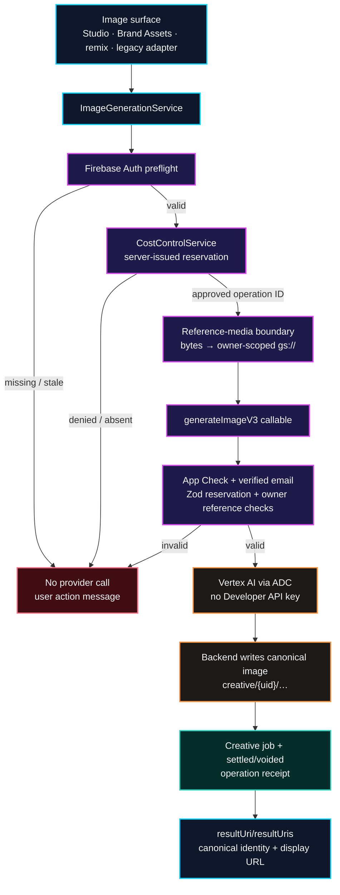

# Canonical Image Generation Admission

Every image-generation surface must use the same server-owned cost, identity,
reference-media, and output contract. A renderer surface may show a signed
download URL, but it never holds a provider credential or treats raw bytes as
a production callable payload.

## Transition rules

1. **Surface → service:** components do not construct a `generateImageV3`
   payload themselves. This avoids schema drift between direct generation,
   Brand Assets, and remix tools.
2. **Reservation:** the browser can request a budget reservation but cannot
   choose its identity, cost, owner, or approval state. The resulting operation
   ID is required by `GenerateImageSchema` and validated again by the gateway.
3. **Reference media:** legacy base64 is permitted only in short-lived
   renderer memory before `CreativeStorageService` uploads it under the
   authenticated user's namespace. The callable receives `gs://` references,
   and the backend verifies bucket, owner path, MIME, and byte limits before
   presenting bytes to Vertex.
4. **Vertex execution:** the callable uses Vertex AI Application Default
   Credentials. It stores generated bytes in project Storage and returns only
   canonical object identities; it does not return a provider key or make the
   renderer responsible for durability.
5. **Client result:** a display URL may expire or be regenerated. Consumers
   that need provenance, future remixing, or video use must retain
   `storageUri`/`resultUri` as the authority.

## Remaining live proof

Local contract tests prove schema agreement and the renderer handoff. A
deployed verified user must still create direct, Brand Asset, and batch-remix
images, then prove their job receipts, canonical objects, 400 validation, and
429 capacity messages. This is tracked as ISSUE-1233.
