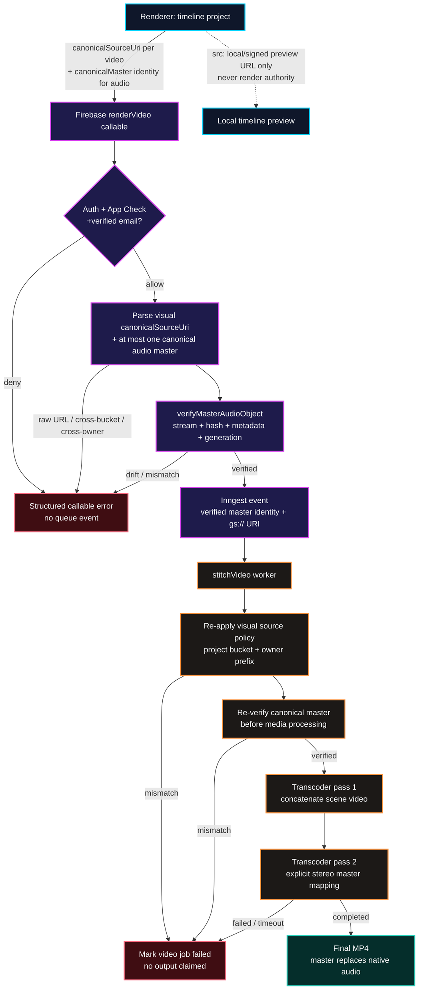

# Canonical Master Video Render Boundary

This flow maps the music-video render path after the canonical-master hardening.
The browser may retain local or signed preview URLs for timeline playback, but
it never authorizes the cloud renderer to fetch media. Each visual clip carries
a separate owner-scoped canonical source URI, while audio carries a canonical
master identity. The server derives the only renderable audio URI after
verifying the owner, content hash, fingerprint, and immutable Cloud Storage
generation.

## Transition rules

1. **Client → callable:** each video clip carries a `canonicalSourceUri` in the configured project bucket under an authenticated-owner prefix. The audio clip carries `canonicalMaster.storagePath`, `contentHash`, `generation`, `masterFingerprint`, and volume. `clip.src` remains local-preview data and is ignored by the callable for render authority.
2. **Admission:** `renderVideo` requires Firebase Auth, App Check, and Firebase's `email_verified` claim before it performs master verification or queues work.
3. **Canonical verification:** the callable accepts only `masters/{uid}/{sha256}/original.wav|flac`. It derives the `gs://` URI from the configured project bucket only after `verifyMasterAudioObject` proves the expected hash, fingerprint, and immutable object generation.
4. **Queue handoff:** asynchronous work receives owner-scoped video `gs://` URIs and the verified master identity, never renderer-controlled download URLs. The stitch worker independently reapplies the visual-source policy and verifies the audio master before using media bytes.
5. **Two Transcoder passes:** first concatenate generated scene videos. Second, use the pass-one MP4 plus the canonical master and explicit left/right audio mappings. The declared policy is truthful: `master_replaces_native`; generated/native scene audio is not represented as mixed until that separate feature has real mapping and verification.
6. **Completion:** only a completed second Transcoder job may set the video job to `completed` and publish its final artifact. Verification failures, Transcoder failures, and timeouts remain failed states.

## Remaining live proof

Local contract tests prove visual-source parsing, owner/hash/generation checks, editor preflight, and the generated Transcoder job configuration. A deployed verified WAV/FLAC project must still prove that the final MP4 has the expected master audio stream, and a crafted visual URI must prove it creates no Transcoder job; those are tracked as ISSUE-1231 and ISSUE-1232 rather than inferred from configuration alone.
