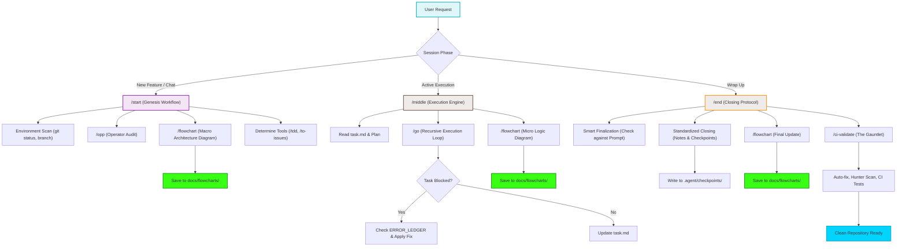

# Core Pipeline Architecture

This document maps the newly implemented core agent development pipeline (`/start` -> `/middle` -> `/end`) and its integrations with sub-commands and tools.

### Transition Breakdown

1. **User Action to Routing (`A -> B`):** The agent identifies the context. If it's a new feature, it runs `/start`. If it's an active build, `/middle`. If wrapping up, `/end`.
2. **Start Phase (`C`):** 
   - `C1` & `C2` ensure the agent isn't building on a broken branch and has full context. 
   - `C3` ensures a macro-level diagram is planned *before* coding.
3. **Middle Phase (`D`):**
   - `D2` uses `/go` for autonomous task loop processing.
   - Blockers `D3` trigger automatic ledger lookups (`D4`) to self-heal.
   - `D6` maps technical complexities (like state transitions) as they are built.
4. **End Phase (`E`):**
   - Validates all tasks and deliverables (`E1`).
   - Ensures memory preservation via Checkpoints (`E2`).
   - Finishes with the `/ci-validate` gauntlet (`E6`) to guarantee a pristine, bug-free codebase before sign-off.
