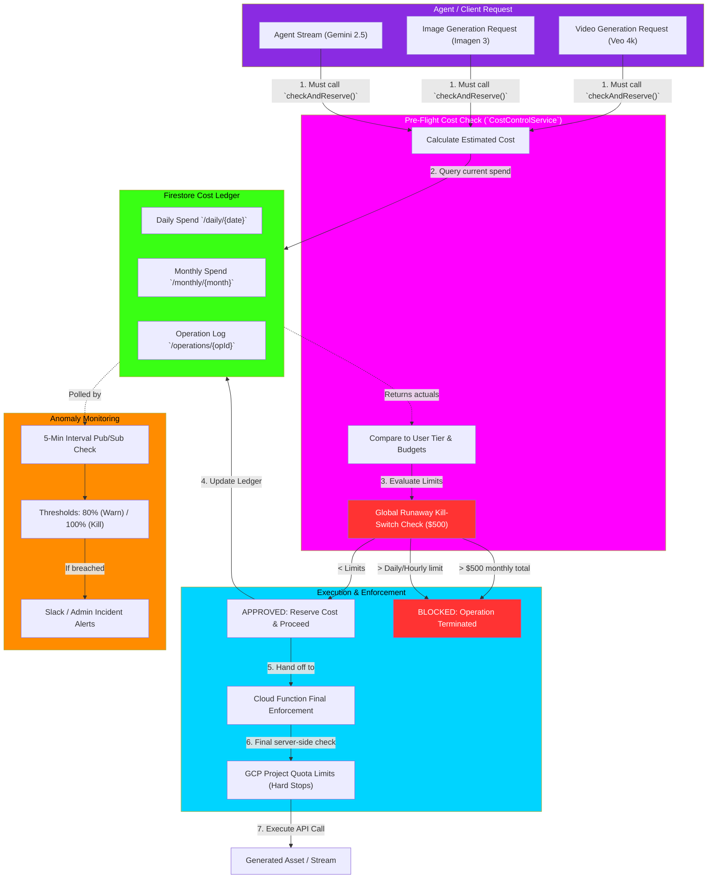

# Universal Cost Control & Kill-Switch System

This flowchart maps the `CostControlService`, which acts as the universal safety net and kill-switch across the entire indii platform. It prevents runaway AI agents from accumulating massive bills by enforcing hard budget caps at the Cloud Function level *before* any expensive operation executes.

## Transition Breakdown

1. **Pre-Flight Estimation:** Before an agent triggers a costly API call (like generating a 60-second 4K video using Vertex AI), it must first call `CostControlService.checkAndReserve()` with an estimated cost based on the `OPERATION_COSTS` catalog.
2. **Ledger Verification:** The service queries the real-time Firestore Cost Ledger to calculate the user's total daily and monthly spend.
3. **The Kill-Switch:** The system checks the estimated cost against the user's specific tier limits (Free, Pro, Enterprise). Regardless of tier, it evaluates the **Global Runaway Kill-Switch** (set at $500/month). If the new operation would push the monthly spend over $500, it instantly terminates with a `RUNAWAY_KILL_SWITCH` error.
4. **Reservation & Execution:** If approved, the system immediately increments the ledger to reserve the funds. The request is passed to the secure Cloud Function layer (`enforceOperationCost`), which performs a final server-side validation to prevent client-side tampering.
5. **GCP Quotas:** As an absolute final backstop, hard quotas are configured at the GCP level via Terraform (e.g., maximum 1,000 Veo requests per month per project).
6. **Anomaly Monitoring:** A background Pub/Sub job runs every 5 minutes, scanning the ledger. If spend velocity spikes or thresholds (80%, 95%, 100%) are breached, it generates high-severity incident alerts.
