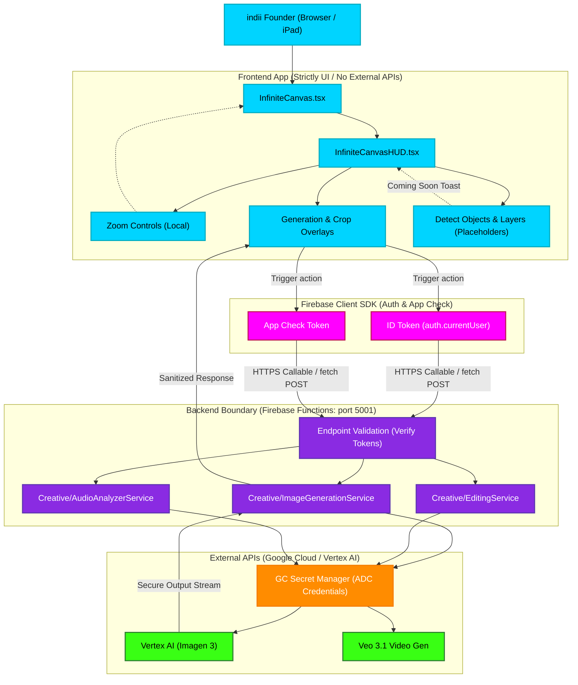

# Creative Studio Architecture & Backend Boundary Flowchart

This flowchart visualizes the strict API security boundary enforced within the indii-music-founder platform, specifically mapping out the Creative Studio (Infinite Canvas) tools we just updated. It proves that **zero API secrets or direct third-party routing** exist in the frontend Vite application. All requests securely route through the Firebase Functions emulator/production environment.

## Step-by-Step Transition Breakdown

1. **User Action:** The user interacts with the `InfiniteCanvasHUD` tools inside `InfiniteCanvas.tsx` (e.g., triggering an Image Generation prompt or cropping).
2. **Local Processing vs. Remote Trigger:** 
   - Operations like **Zoom** modify the `scaleRef` state locally and trigger an immediate re-render (`requestDraw()`). 
   - Unimplemented features like **Layers** and **Detect Objects** trigger honest "Coming Soon" tooltips directly in the UI.
   - Remote actions like **Generate** or **Flatten** bundle up the request payload.
3. **Security Handshake:** The frontend strictly requests a fresh ID Token (`auth.currentUser.getIdToken()`) and App Check attestation token from the Firebase Client SDK.
4. **Boundary Transition:** The frontend performs an HTTPS Callable or `fetch` request to the Firebase Functions emulator (`localhost:5001`), attaching the secure tokens in the headers. *No external API keys (e.g., Vertex AI, Gemini) are exposed or sent.*
5. **Backend Validation:** The Firebase Function verifies the ID Token and App Check token. If unauthorized, it rejects the request instantly (`403 Forbidden` / `401 Unauthorized`).
6. **Credential Injection:** The verified Cloud Function uses Google Application Default Credentials (ADC) or queries Google Cloud Secret Manager to safely inject the hidden server-side keys.
7. **External API Execution:** The function talks directly to the Vertex AI APIs (Imagen 3, Veo 3.1) executing the complex generation pipelines securely on Google Cloud.
8. **Sanitized Response:** The backend receives the raw payload, scrubs any server metadata, and securely returns the clean base64 image or SSE stream back to the React client to render for the user.
