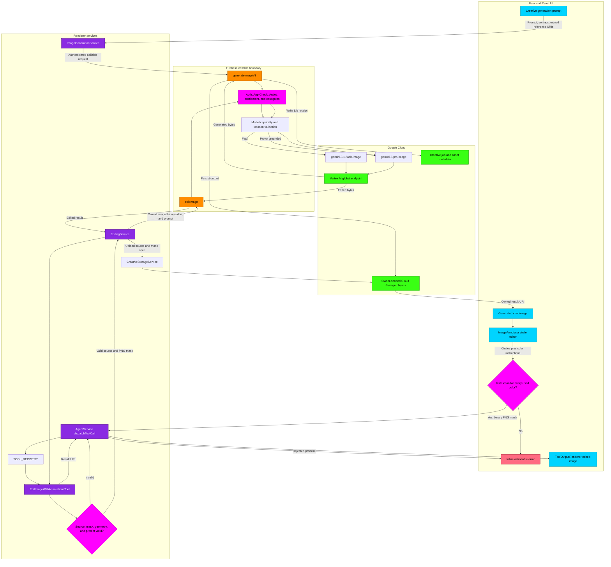

# Creative Studio Image Generation and Annotation Flowchart

This diagram maps the current image-generation and spatial-annotation paths. It distinguishes the direct `generateImageV3` callable from the inline annotation adapter that ultimately invokes the separate `editImage` callable.

## Transition Breakdown

1. **Direct generation:** `ImageGenerationService` sends the signed-in user's prompt, model tier, aspect ratio, and owned reference URIs to `generateImageV3`. Browser API keys are never part of the payload.
2. **Admission and routing:** The callable applies authentication, App Check, abuse protection, entitlement, and cost controls before model execution. Image requests use the Vertex AI global endpoint. Fast routes to `gemini-3.1-flash-image`; Pro and supported Google Search grounding route to `gemini-3-pro-image`.
3. **Persistence:** The backend writes generated bytes to owner-scoped Cloud Storage and records the corresponding creative job or asset metadata. The renderer receives the owned result URI and renders the generated image.
4. **Annotation capture:** `ImageAnnotator` records red, blue, and yellow circles in natural-image coordinates. Every used color must have a non-empty instruction. The UI converts the union of those regions into a black-and-white PNG mask.
5. **Tool validation:** `AgentService` calls the registered `edit_image_with_annotations` tool. `EditImageWithAnnotationsTool` rejects missing sources, non-HTTPS remote sources, non-PNG masks, unsupported colors, invalid geometry, excessive annotations, and missing or oversized instructions before provider work begins.
6. **Secured edit:** `EditingService` uploads the source and mask through `CreativeStorageService`, then calls `editImage` with owned `gs://` URIs. The edit callable applies the same server-side admission boundary and executes the Pro image model on the global endpoint.
7. **Success and recovery:** A successful tool result is surfaced through `ToolOutputRenderer`. A tool error is converted into a rejected direct call, preserved in the agent system history, and shown as an inline alert while the user's circles and instructions remain available for retry.
