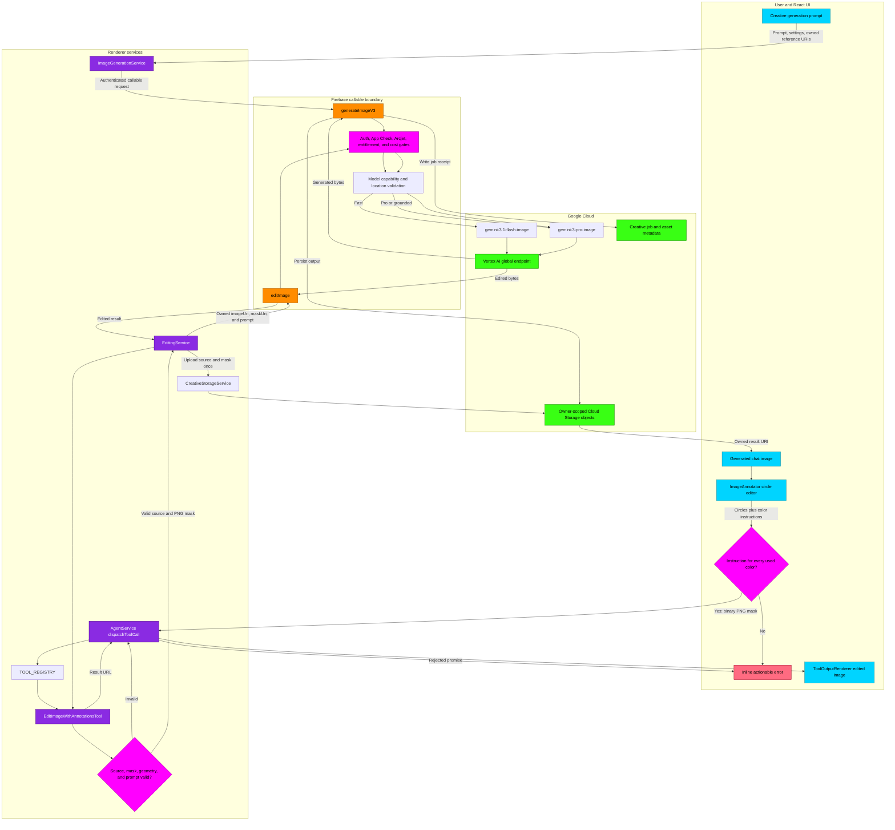

# Creative Studio Image Generation and Annotation Flowchart

This diagram maps the current image-generation and spatial-annotation paths. It distinguishes the direct `generateImageV3` callable from the inline annotation adapter that ultimately invokes the separate `editImage` callable.

## Transition Breakdown

1. **Direct generation:** `ImageGenerationService` sends the signed-in user's prompt, model tier, aspect ratio, and owned reference URIs to `generateImageV3`. Browser API keys are never part of the payload.
2. **Admission and routing:** The callable applies authentication, App Check, abuse protection, entitlement, and cost controls before model execution. Image requests use the Vertex AI global endpoint. Fast routes to `gemini-3.1-flash-image`; Pro and supported Google Search grounding route to `gemini-3-pro-image`.
3. **Persistence:** The backend writes generated bytes to owner-scoped Cloud Storage and records the corresponding creative job or asset metadata. The renderer receives the owned result URI and renders the generated image.
4. **Annotation capture:** `ImageAnnotator` records red, blue, and yellow circles in natural-image coordinates. Every used color must have a non-empty instruction. The UI converts the union of those regions into a black-and-white PNG mask.
5. **Tool validation:** `AgentService` calls the registered `edit_image_with_annotations` tool. `EditImageWithAnnotationsTool` rejects missing sources, non-HTTPS remote sources, non-PNG masks, unsupported colors, invalid geometry, excessive annotations, and missing or oversized instructions before provider work begins.
6. **Secured edit:** `EditingService` uploads the source and mask through `CreativeStorageService`, then calls `editImage` with owned `gs://` URIs. The edit callable applies the same server-side admission boundary and executes the Pro image model on the global endpoint.
7. **Success and recovery:** A successful tool result is surfaced through `ToolOutputRenderer`. A tool error is converted into a rejected direct call, preserved in the agent system history, and shown as an inline alert while the user's circles and instructions remain available for retry.

## Current State — Capability Reporting & Agent Asset Access (ISSUE-1359, 2026-08-18)

This section documents the state after ISSUE-1359. It exists because the previous
diagram stopped at persistence and said nothing about how the product *reports*
generation capability or how agents *reuse* stored assets — and both surfaces had
silently drifted from the code.

1. **Capability evidence loop:** `getCapabilitySnapshot` reads the user's recent
   `creative_jobs` and reports `image_generation` / `video_generation` as
   `available` only when a completed job exists within a 7-day window.
   `listRecentMediaJobs` **must order by `createdAt` descending** before its
   `limit(50)`; an unordered query returns documents in ID order, so with more
   than 50 jobs the snapshot can report `unverified` right after a successful
   generation — and the Boardroom agent then truthfully says the pipeline is
   "offline" even though generation works. Keep the `orderBy` when touching this
   reader.
2. **Agent asset access:** the Creative Director's `list_domain_records` tool
   reads top-level `canvases`, `storyboards`, and `concept_art` collections with
   a `userId` filter. Firestore rules for all three are owner-read only
   (`isVerifiedUser() && resource.data.userId == request.auth.uid`), with all
   client writes denied. If a new domain collection is added to
   `DomainTools`, a matching rule block must be added in the same change —
   otherwise the agent correctly reports "no permission" and the doc drifts
   again.
3. **Stream failure hygiene:** the renderer's `FirebaseIntelligenceService`
   normalizes mid-body stream aborts (instance recycle, dropped connection,
   proxy timeout) into a retryable `NETWORK_ERROR` AppException. Raw undici
   messages ("BodyStreamBuffer was aborted") must never reach a Boardroom
   verdict; if a raw engine string ever appears in user-visible text, that is a
   regression of `normalizeStreamInterruption`.
