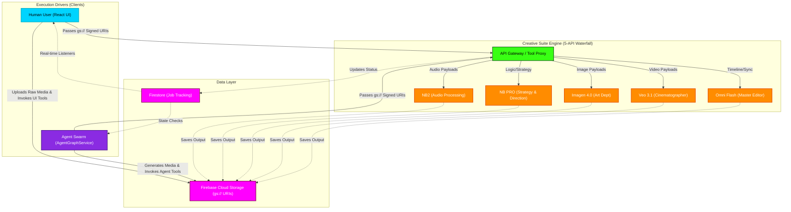

# Creative Suite Hybrid Execution Flowchart

This flowchart maps the Hybrid Architecture model where the **Human User** and the **AI Swarm** act as peer "drivers" that both utilize the unified **Creative Suite Engine** (the 5-API Waterfall) to generate and edit media assets.

## Transition Breakdown

1. **Payload Upload (The Thin Client Protocol):**
   - Whether triggered by the human user clicking a button in the React UI, or an Agent Swarm tool autonomously deciding to create an asset, the raw binary file is **first** uploaded directly to Firebase Cloud Storage. 
   - No Base64 strings are ever passed in memory.
2. **Execution Trigger:**
   - The driver (Human or Swarm) calls the API Gateway, passing only the lightweight `gs://` Signed URIs. This completely decouples the heavy rendering process from the client devices.
3. **The 5-API Waterfall (Creative Suite):**
   - The Gateway acts as the "Traffic Cop", routing the request to the correct Vertex AI endpoint (Imagen 4.0 for images, Veo 3.1 for video, NB2 for audio analysis).
4. **Asynchronous Completion:**
   - The AI models run asynchronously. Upon completion, the backend uploads the final generated asset directly back to Cloud Storage.
   - The Gateway updates the Firestore job ticket to `completed`.
5. **State Sync:**
   - The Human UI receives a real-time snapshot update via Firestore listeners to display the new asset.
   - The Agent Swarm polls the job status or receives the URI callback, allowing it to continue its reasoning loop with the newly created asset.
