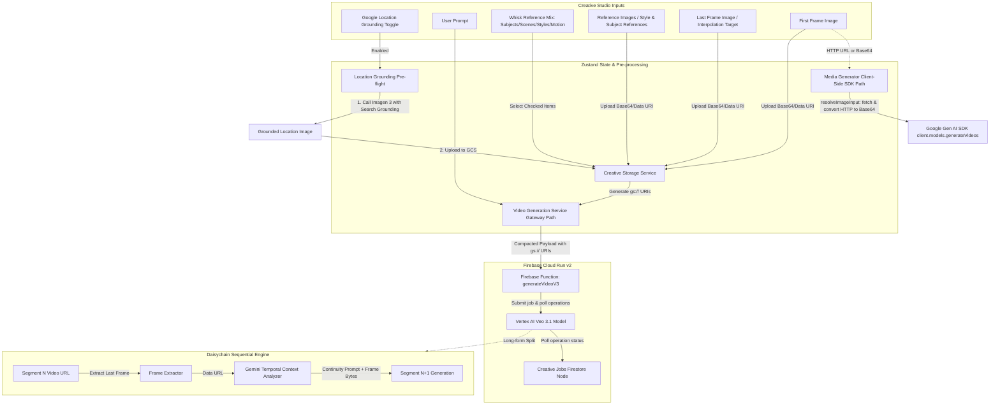

# Creative Video & Image Integration Architecture

This flowchart maps the unified client-side and backend execution path for advanced video and image generation in the indii Creative Department.

## Macro-Level Architecture Flowchart

## Step-by-Step Transition Breakdown
- **UI_Inputs to Client_State**: User options (prompt, references, framing targets) are processed by Zustand slices and pre-flight logic on the client.
- **Client_State to Backend_Gateway**: Reference media is uploaded to Cloud Storage to produce `gs://` URIs, which are sent in a compacted payload to `generateVideoV3`.
- **Backend_Gateway to Daisychain_Loop**: Long-form requests are segmented and run sequentially using frames extracted from previous blocks to maintain visual continuity.
