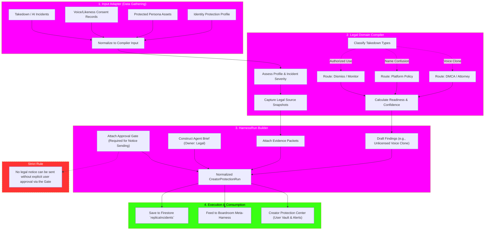

# Creator Protection Harness Deep-Dive

This flowchart represents a deep-dive into the `Creator Protection` harness, which is currently categorized as a **Done** harness in the architectural plan. It illustrates how specific domain logic maps directly onto the Universal Harness Compiler pipeline.

## Transition Breakdown

1. **Input Adaptation:** The adapter gathers highly sensitive data—biometric consent records, known authorized AI replica licenses, and active infringement incidents—and normalizes them safely.
2. **Domain Compilation (The Legal Logic):** 
   - The compiler categorizes incidents (e.g., copyright vs. right of publicity vs. platform terms of service). 
   - It captures **Legal Source Snapshots**, ensuring that the state of the law or platform policy at the time of the incident is preserved immutably.
   - It calculates the legal readiness score and defines the boundaries of what an attorney must review.
3. **HarnessRun Building:** The compiler maps its findings into the generic `HarnessRun` schema. 
   - It attaches strict **Evidence Packets**.
   - It drafts the `HarnessAgentBrief` for the LegalAgent.
   - **Crucially:** It drafts the takedown notice but *attaches a strict Approval Gate*. The system guarantees that no automated DMCA or legal threat will ever be dispatched without explicit user intervention.
4. **Output & Consumption:** The finalized `CreatorProtectionRun` is saved, fed directly to the Boardroom for cross-domain evaluation, and rendered in the user-facing "Creator Protection Center" UI.
