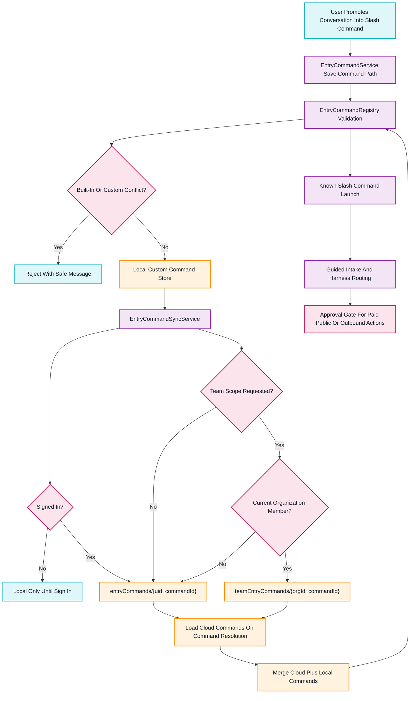

# Custom Command Cloud Sync

This flowchart maps how promoted custom slash commands move between local fallback storage, user cloud storage, and organization/team storage.

## Transition Breakdown

1. `EntryCommandService` receives `/save-command` or a natural promotion phrase and builds a custom command definition from recent conversation context.
2. `EntryCommandRegistry` normalizes the slash name and aliases, then rejects any built-in or already-saved custom command conflict.
3. The command is saved locally first so the app keeps working offline or when Firestore is unavailable.
4. `EntryCommandSyncService` mirrors the command to `entryCommands/{uid_commandId}` when a signed-in user is available.
5. If a team scope is requested and the app has a current organization, the same command can be mirrored to `teamEntryCommands/{orgId_commandId}`. Firestore rules require organization membership.
6. Command resolution hydrates cloud commands before normal launch flows where possible, then merges cloud and local records with built-ins remaining reserved.
7. Saved commands still pass through the same guided intake and approval-gate behavior. Cloud sync never executes paid, public, or outbound actions.
