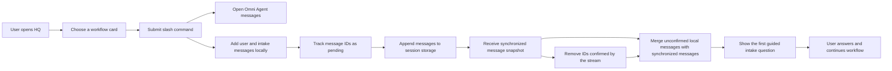

# Dashboard Guided Workflow Message Synchronization

This flowchart maps the first-use path from a dashboard workflow card to the guided intake shown in the Omni Agent panel. It also records the optimistic-message boundary that prevents an empty initial subscription snapshot from erasing a command before Firestore confirms it.

## Step-by-Step Transition Breakdown

1. **HQ to workflow card:** The dashboard presents concrete business jobs such as brand analysis, video creation, and release building.
2. **Card to command:** Selecting a card submits its registered slash command immediately instead of merely filling an input.
3. **Command to chat surface:** The Omni Agent panel opens so the result and next required question are visible.
4. **Local optimistic state:** The user command and generated intake question render immediately and their message IDs are marked pending.
5. **Persistence:** Each message is appended to the active session's append-only storage.
6. **Subscription reconciliation:** Incoming synchronized snapshots remain authoritative for confirmed messages while pending local messages are retained until their IDs appear remotely.
7. **Guided continuation:** The first question stays visible, allowing the user to answer and advance the workflow without a blank-panel dead end.
