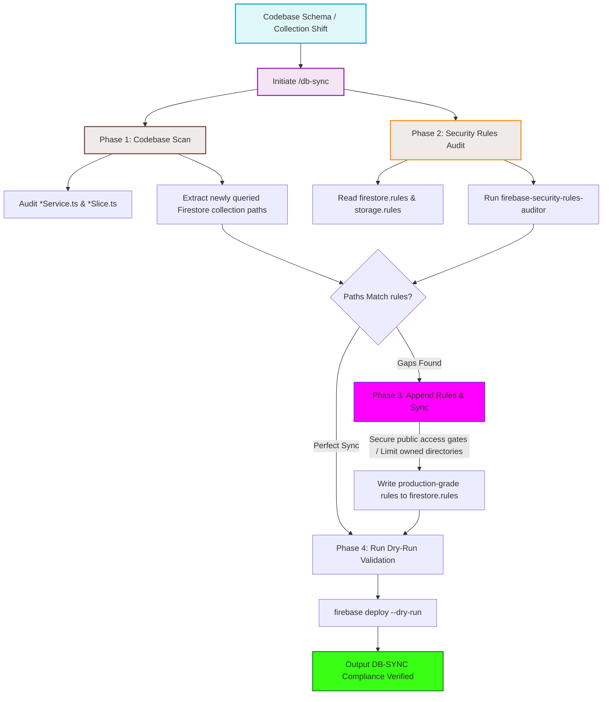

# Database Security Rules & Sync Workflow

This diagram maps the automated synchronization and audit process executed by `/db-sync` when codebase schemas or collections shift.

## Step-by-Step Transition Breakdown

1. **Extraction Gate (`C1 -> C2`):** When a collection name or query gets touched in services or store slices, `db-sync` scrapes the codebase changes to resolve the exact collection paths.
2. **Rules Audit (`D1 -> D2`):** Concurrently, the rules files are loaded and checked for loose wildcard read/writes or standard owner authentication leaks.
3. **Synchronization Logic (`E -> F -> G`):** If a query path has no matching rule, `Phase 3` resolves the structural gap by drafting production-grade rules (e.g. owner read/write isolates) and appending them safely.
4. **Pruning & Verification (`H -> H1 -> I`):** The final rules are run against Firebase's CLI dry-run validator to guarantee syntactic correctness before completing the compliance check.
