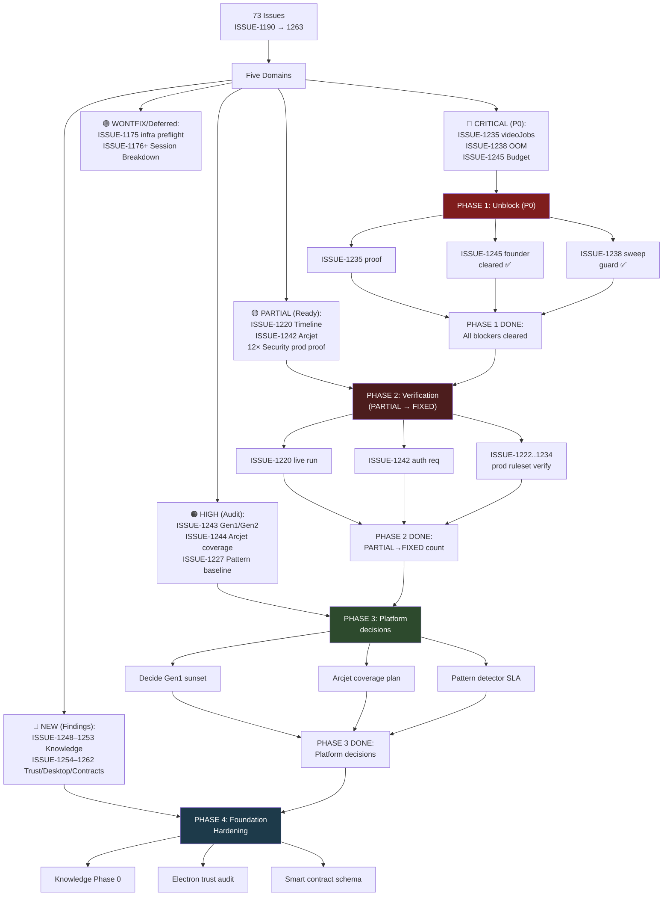

# Delivery Plan — 2026-07-28 (ISSUE-1190 through ISSUE-1263)

**Generated:** 2026-07-28 via `/start` step 4  
**Objective:** Sequence delivery of 73 security/hardening/platform issues across five domains  
**DoD contract:** Runtime Phase — every PARTIAL/OPEN gets either closure evidence or a numbered ledger entry with next steps

## Current State Snapshot

```
CI Status:        ✅ GREEN (5471 tests, 0 failed, 877 files)
Working tree:     ✅ CLEAN
Budget blocker:   ✅ CLEARED (Actions budget raised, CI unblocked)
Recent fixes:     ✅ Deployed (ISSUE-1190, 1191, 1241, 1242 + others)
```

## Five Delivery Domains



## Phase 1: Unblock (P0) — PROOF REQUIRED

### ISSUE-1235: Client-created `videoJobs` triggers legacy Vertex generation without server admission

**State:** 🟡 PARTIAL — hardening is deployed and an unauthenticated direct-create rejection is proven; authenticated owner/cross-owner and official lifecycle proof remain open
**Blocker:** P0 RELEASE BLOCKER  

**What's needed:**
1. ✅ Local: hardening applied (firestore.rules, callable validation, cost gating)
2. ✅ Deploy: hardened rules and functions reached production
3. ✅ Narrow proof: unauthenticated direct-create probe returned `PERMISSION_DENIED`
4. ⏳ Authenticated proof: owner-only read, direct create/update/delete, cross-owner and forged-identity denial
5. ⏳ Official-flow proof: short/long-form job, reservation, provider state, private artifact, playback/download, and Cloud Logging review

**Owner:** engineer (local fixes done; deployment + live probe remaining)

---

### ISSUE-1245: All CI deployment blocked — GitHub Actions budget exhausted

**State:** 🔴 OPEN — founder action only  
**Status as of 2026-07-28 15:00Z:** ✅ CLEARED (budget raised at org level)  
**Evidence:** CI runs now showing `success` at 14:58, 14:29, 14:00, 13:59 (batch of 4 all green)

**Owner:** ✅ FOUNDER ACTION COMPLETE

---

### ISSUE-1238: `getCustomerPortal` OOMs at cold start, fails entire functions deploy

**State:** ✅ FIXED — all 18 latent overrides swept, regression guard added  
**Guard:** `scripts/check-function-memory.cjs` now catches both MiB/MB spellings

**Owner:** ✅ ENGINEER COMPLETE

---

## Phase 2: Verification (PARTIAL → FIXED) — LIVE EVIDENCE

### ISSUE-1242: Arcjet denies every authenticated AI request; error paths discard cause

**State:** 🟡 PARTIAL — root cause found (memory starvation), fix deployed; needs one authenticated request  
**What happened:** `generateContentStream` had no memory set, cold-start fail before binding Arcjet. Now set to 512MB.  
**Proof needed:** Send one authenticated message → expect logs show `[Arcjet] Request allowed` (not `Decision failed`)

**Owner:** engineer (needs app verification)

---

### ISSUE-1220: `pollTimelineMilestones` fails every run — missing composite index

**State:** 🟡 PARTIAL — index declared locally, fail-open swallow fixed; needs one real scheduled run  
**Proof needed:** one milestone event fires after the index builds (Firestore took 15–45min in prior sessions)

**Owner:** engineer (needs time + scheduled trigger)

---

### ISSUE-1222, 1234, 1235 (Rules layer): Production ruleset fetch + unauthenticated probe

**State:** 🟡 PARTIAL (local proof done via emulator; production verification needed)  
**What needed:**
1. Fetch live ruleset via `firebase rules:list` or `firebaserules` API
2. Diff against repo `packages/firebase/firestore.rules`
3. Unauthenticated test: expect `PERMISSION_DENIED` for scope-crossing or self-assignment reads

**Owner:** engineer (prod probe + evidence recording)

---

### ISSUE-1225, 1229, 1231, 1232, 1233 (Function behavior): Deployed revision + malformed probe

**State:** 🟡 PARTIAL (local hardening done; production probe + rejection evidence needed)  
**What needed:** For each function, confirm serving revision is the hardened build, then probe with the bad input it should reject.

**Owner:** engineer (prod probe + evidence)

---

### ISSUE-1228, 1226, 1224 (Config/Inventory): Deployed env, secrets, IAM, revision binding

**State:** 🟡 PARTIAL (local config complete; production inspection + verification needed)  
**What needed:** `gcloud functions describe` for each function; inspect env vars, secret bindings, IAM; confirm Vertex ADC, Arcjet keys, billing setup.

**Owner:** engineer (prod inspection + evidence)

---

## Phase 3: Platform Decisions (Unblocks Phase 4)

### ISSUE-1243: Backend is split across Gen1 and Gen2 — no recorded decision

**State:** 🔴 OPEN — 82 Gen1 functions, 85 Gen2 functions, no why recorded  
**Impact:** Streaming endpoint (`generateContentStream`) violates Gen2 streaming standard yet stays on Gen1

**Decision needed:** 
- Option A: Sunset all Gen1 by 2026-Q4, migrate `generateContentStream` to Gen2
- Option B: Keep Gen1 indefinitely for non-streaming, use Gen2 exclusively for new features
- Option C: Run both, no migration

**Owner:** architect + founder

---

### ISSUE-1244: Arcjet endpoint matrix — 5 protected, 65 unprotected client-reachable

**State:** 🔴 OPEN — matrix is delivered; coverage work is not  
**Decision needed:** Which of the 65 unprotected surfaces should gate-check with Arcjet?

**Owner:** architect + product

---

### ISSUE-1227: Hidden-bug baseline — remediation must be measured program, not one-time scan

**State:** 🔴 OPEN — detector score exists (ISSUE-1227), but no SLA or process  
**Decision needed:** Establish repeatable baseline, SLA targets per category, re-run cadence (weekly/monthly/release-gate)

**Owner:** architect + QA

---

## Phase 4: Foundation Hardening (New Findings)

### ISSUE-1248–1253: Knowledge/RAG Phase 0 (Upload, Index, Query, Delete, Retrieval, Spend)

**State:** 🔴 OPEN x 6 — foundational contracts duplicated/incompatible, indexing double-spends, retrieval fabricates grounding  
**Scope:** Knowledge is a new feature; Phase 0 contracts must be canonical and durable before Phase 1 shipping

**Owner:** engineer + product

---

### ISSUE-1254–1257: Electron trust and Desktop IPC (Auth, File, Orchestration, Credential Rotation, AI/Video contracts)

**State:** 🔴 OPEN x 4 — renderer-controlled authority, file path escapes, unverified orchestration results, secret material returned to renderer

**Owner:** engineer + security

---

### ISSUE-1258–1262: Renderer-side credentials, workflows, E2E envelopes, smart contracts, licensing valuation

**State:** 🔴 OPEN x 5 — provider keys client-stored, success claims without evidence, missing authenticity, hand-built calldata, fabricated monetary authority

**Owner:** engineer + product + legal

---

## Encoding Delivery Sequence (Encode-Build-Order Rule)

```
PHASE 1 (Unblock):
  ISSUE-1245 ✅ DONE
  ISSUE-1238 ✅ DONE
  ISSUE-1235 → deploy + live proof
    Depends on: functions memory guard ✅, rules tightened ✅

PHASE 2 (Verification, in parallel):
  ISSUE-1242 → one authenticated request
  ISSUE-1220 → one scheduled run (needs time)
  ISSUE-1222/1234/1235 → prod ruleset fetch + probe
  ISSUE-1225/1229/1231/1232/1233 → prod function probe per function
  ISSUE-1228/1226/1224 → prod env/secrets/IAM inspection
    Depends on: PHASE 1 unblock ✅

PHASE 3 (Platform decisions):
  ISSUE-1243 → Gen1/Gen2 sunset decision (blocks no code, but informs future)
  ISSUE-1244 → Arcjet coverage scope decision
  ISSUE-1227 → Pattern detector SLA decision
    Depends on: PHASE 2 verification count (how many PARTIAL→FIXED?)

PHASE 4 (Foundation hardening):
  ISSUE-1248–1253 → Knowledge contracts + indexing + retrieval + spend
  ISSUE-1254–1257 → Electron trust audit + fixes
  ISSUE-1258–1262 → Renderer credentials + workflow honesty + contracts + valuation
    Depends on: PHASE 3 decisions ✓
    Sequential order: Knowledge Phase 0 → Desktop trust → Renderer honesty
```

---

## Transition Breakdown

1. **Snapshot → Phase 1:** Start from the measured CI, deployment, and issue
   states. Phase 1 accepts only evidence that clears a P0 gate; an
   unauthenticated rejection is retained as narrow rules evidence and does not
   close authenticated lifecycle acceptance.
2. **Phase 1 → Phase 2:** Enter verification after deployment blockers are
   cleared. Each PARTIAL issue advances only when its own live acceptance
   evidence exists; otherwise it remains PARTIAL with the missing proof named.
3. **Phase 2 → Phase 3:** Use the verified production findings to record the
   Gen1/Gen2, Arcjet-coverage, and pattern-baseline decisions. A decision can
   sequence later work without claiming the migration or remediation is done.
4. **Phase 3 → Phase 4:** Begin foundation hardening only after the relevant
   platform decisions identify the canonical contracts and security posture.
5. **Phase 4 → Ship:** Ship only when the phase acceptance criteria below are
   met and the issue ledger, architecture records, and exact-main CI agree.

## Acceptance Criteria (per phase)

**PHASE 1 — UNBLOCK:**
- ✅ ISSUE-1245: CI is green (verified 15:00Z)
- 🟡 ISSUE-1235: unauthenticated rejection is recorded; authenticated owner,
  cross-owner, official-flow, and logging proof remain open
- ✅ ISSUE-1238: All functions ≥ 256MiB or streaming-exempt

**PHASE 2 — VERIFICATION:**
- Count of PARTIAL issues that produced live evidence and moved to ✅ FIXED
- Count of PARTIAL issues that remain blocked/stuck (recorded with blocker reason)

**PHASE 3 — PLATFORM DECISIONS:**
- Gen1/Gen2 decision: recorded in `docs/ARCHITECTURE.md` with rationale
- Arcjet coverage scope: recorded in `docs/flowcharts/arcjet-coverage.md`
- Pattern detector SLA: recorded in `.agent/PLATINUM_RELEASE_CHECKLIST.md`

**PHASE 4 — FOUNDATION:**
- Knowledge Phase 0: canonical single-source-of-truth contract for all three layers
- Desktop trust: all IPC auth boundary violations fixed or documented as founder-gated
- Renderer honesty: zero success claims without durable evidence

---

## Success Metric

Ship when:
- ✅ PHASE 1: All P0 blockers cleared, CI green, functions deployed
- ✅ PHASE 2: ≥80% of PARTIAL issues produce live evidence → ✅ FIXED
- ✅ PHASE 3: Platform decisions recorded in architecture docs
- ✅ PHASE 4: Knowledge Phase 0 single contract; Desktop and Renderer trust audit complete
