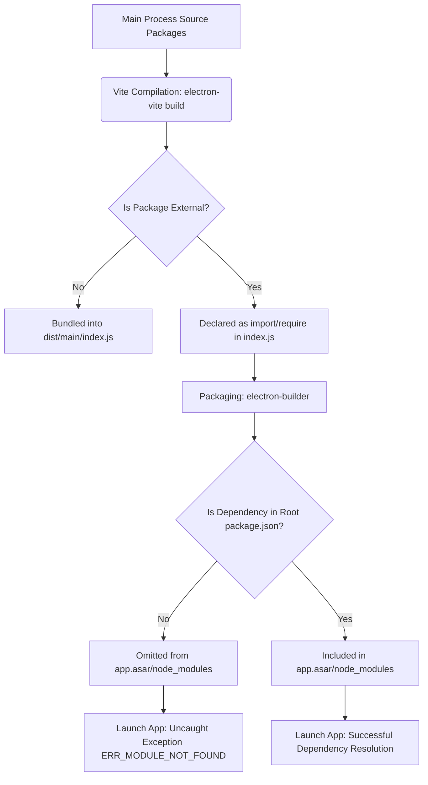

# Flowchart: Electron Desktop Dependency Packaging Pipeline

This flowchart outlines the dependency resolution process during the build and packaging of the `indii.music` desktop application, demonstrating why adding external dependencies to the root `package.json` resolves the runtime `ERR_MODULE_NOT_FOUND` exceptions.

## Detailed Explanation

1. **Source Code Analysis**: The Main Process source code (`packages/main/src/`) relies on various packages such as `electron-log`, `electron-store`, `chokidar`, etc.
2. **Vite Compilation**: During `electron-vite build`, the configuration file `electron.vite.config.ts` designates these packages as `external`. They are not bundled into the compilation output `dist/main/index.js`.
3. **Packaging Stage**: `electron-builder` runs at the root of the project to bundle the compiled assets (`dist/`) into a DMG, EXE, or AppImage. It scans the `dependencies` list in the root `package.json` to determine which node modules to package into the final `app.asar/node_modules/`.
4. **The Bug**: Since these dependencies were only defined in `packages/main/package.json` and not in the root `package.json`, they were omitted from the final package, resulting in runtime launch crashes.
5. **The Fix**: Declaring the externalized dependencies in the root `package.json`'s `dependencies` instructs `electron-builder` to package them correctly, ensuring a successful application launch.
