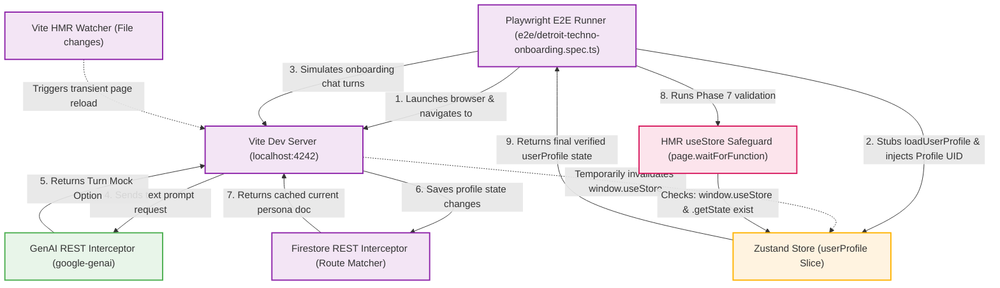

# Detroit Techno Onboarding E2E Flowchart

This flowchart outlines the E2E testing architecture for the Detroit Techno/House Onboarding loop, mapping the sequential steps of user profile injection, state verification, mock API intercepts, and Vite Hot Module Replacement (HMR) state reload safeguards.

## Detailed Transition Walkthrough

1. **Test Bootstrap**: The Playwright runner launches the Chromium browser and navigates to the Vite development server running the studio application on port `4242`.
2. **Profile Inception & Mocking**: Immediately when the window object initializes, the test intercepts `window.useStore` to inject `test-user-uid-e2e` for the user session, stubs `loadUserProfile` to prevent remote Firestore overwrites, and sets up route listeners.
3. **Chat Simulation**: Playwright sequentially types bios, prompts, and clicks Turn options for each Detroit Techno / House persona.
4. **GenAI Interception**: The app calls the Google Developer Knowledge / GenAI client endpoints, which are intercepted in the E2E spec to return deterministic, safe mock choices mapped to the current artist profile's aesthetic goals (e.g. Vintage, Minimalist).
5. **Firestore REST Intercepts**: To sync the profile database document safely, REST Firestore updates/retrievals are intercepted on the fly.
6. **HMR Reload Safeguard**: In local developer environments, Vite file watcher checks (or HMR invalidations on contexts) can cause a transient reload. During reloads, `window.useStore` is temporarily unset. The runner uses `page.waitForFunction` to yield until `window.useStore` and `window.useStore.getState` are fully hydrated and functional on the window context, ensuring zero false-alarm test failures.
7. **Final Assertions**: Once verified, the runner asserts the profile data matches the initial Motor City artist criteria.
