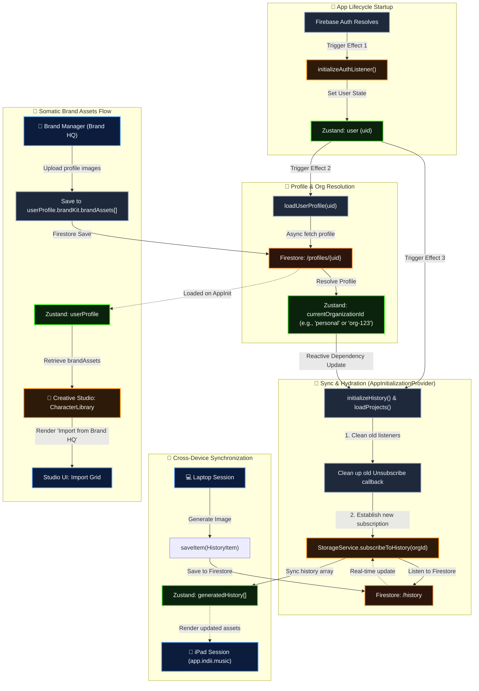

# Cross-Device Sync & Brand Assets Integration

This flowchart illustrates the technical implementation of:
1. **The Cross-Device Sync Handshake**: Resolving the race condition between Auth, asynchronous Profile loading, and real-time Firestore subscriptions (History/Projects).
2. **Somatic Brand Assets Flow**: The mapping of assets uploaded in the Brand Manager (Brand HQ) into the Creative Studio (Art Department) Character Library.

## Step-by-Step Sync Handshake

1. **Auth Lifecycle Initiation**: On application startup, the Firebase Auth state resolves and sets `state.user` in the Zustand store.
2. **Asynchronous Profile Fetch**: Once the authenticated user state is populated, Effect 2 triggers `loadUserProfile(uid)`, fetching the user's profile documents containing their active organization IDs.
3. **Reactive Organization Sync**: While the profile document loads, the global store holds a placeholder/default organization ID (`'org-default'`).
4. **Subscription Hot-Reload**: Once the profile document loads and updates the Zustand store's `currentOrganizationId`, the `AppInitializationProvider` detects the dependency change, tears down the placeholder subscriptions, and establishes the durable real-time Firestore listeners (`subscribeToHistory()`) and metadata fetches (`loadProjects()`) on the correct, active organization.
5. **Cross-Device Rendering**: When an image or video asset is generated on a laptop, it is pushed to Firestore `/history` using the active organization ID. The iPad session, listening in real-time to that same organization ID, immediately receives the update and renders the history changes.
6. **Somatic Brand HQ Assets**: Assets uploaded in the Brand Manager are saved directly to `userProfile.brandKit.brandAssets` inside the user profile document. When loading the Creative Studio, the Character Library pulls from `userProfile` and surfaces an "Import from Brand HQ" grid, allowing direct use of these face photos and brand logos in generated visuals.
