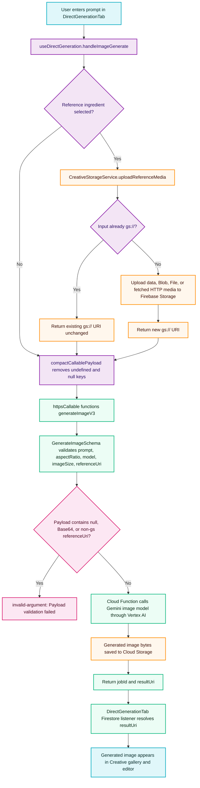

# Direct Image Generation Vertex AI Architecture

This flowchart maps the direct Creative Hub image-generation path. It documents the thin-client payload boundary that prevents raw Base64 and `null` reference fields from reaching the `generateImageV3` Cloud Function.

## Transition Breakdown

1. The user starts direct image generation from `packages/renderer/src/modules/creative/components/DirectGenerationTab.tsx`. The component delegates execution to `useDirectGeneration.handleImageGenerate` in `packages/renderer/src/modules/creative/hooks/useDirectGeneration.ts`.
2. The hook checks `videoInputs.ingredients[0]`. If no reference ingredient exists, `referenceUri` remains unset and `compactCallablePayload` removes it before the Firebase callable request is made.
3. If a reference ingredient exists, `CreativeStorageService.uploadReferenceMedia` enforces the thin-client media boundary. Existing `gs://` strings pass through unchanged. Data URLs, `Blob`, `File`, and HTTP references are uploaded into Firebase Storage and converted to `gs://` before use.
4. The callable payload sent to `generateImageV3` contains only concrete values. This prevents the strict Zod schema in `packages/firebase/src/functions/creative/gateway.ts` from receiving `referenceUri: null`, raw Base64, or an HTTP URL.
5. The Cloud Function validates the request. Invalid payloads fail at the Zod gate with `invalid-argument`; valid payloads continue to the Gemini image model via the backend Vertex AI client.
6. Generated image bytes are saved to Cloud Storage by the Cloud Function. The client receives lightweight job metadata and resolves the final Storage URL through the Firestore job listener before adding the image to the Creative gallery/editor.
