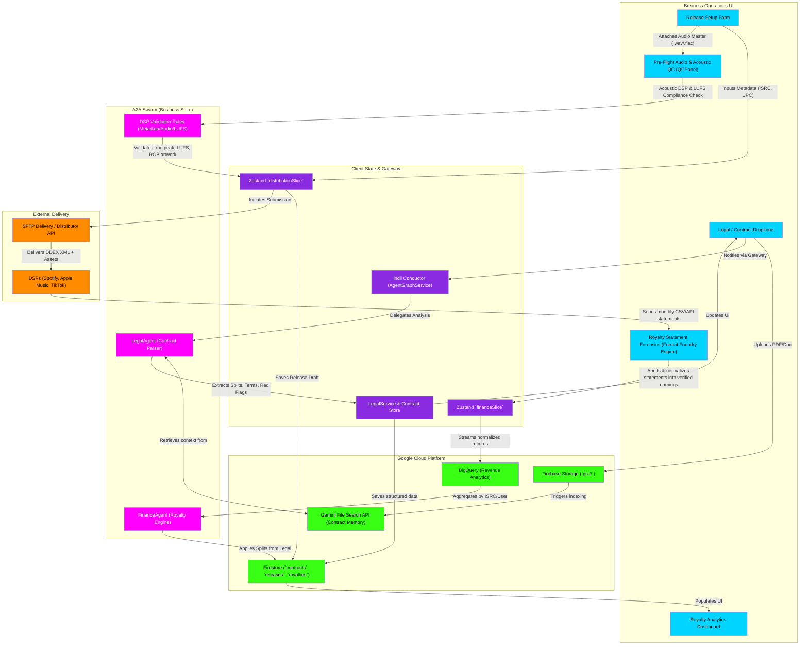

# Distribution, Legal & Royalties Flowchart

This flowchart maps the business operations lifecycle within indii. It details how the LegalAgent parses contracts (splits, record deals), how distribution assets undergo Pre-Flight Audio & Acoustic QC (LUFS compliance, acoustic DSP) and DSP validation for streaming platforms, and how royalty tracking ingests distributor statements through Royalty Statement Forensics (absorbed Format Foundry engine) into verified earnings and global state.

## Step-by-Step Transition Breakdown

1. **Contract Ingestion:** A user uploads a music industry contract (PDF) into the **Legal / Contract Dropzone**. The file is uploaded to **Firebase Storage** and immediately indexed by the **Gemini File Search API** for native RAG capability.
2. **AI Legal Parsing:** The **indii Conductor** routes the request to the **LegalAgent**. The LegalAgent natively queries the File Search API to read the document. It uses its deterministic tools to extract strict numerical splits, terms, and potential "red flag" clauses (e.g., perpetual rights).
3. **Structured Persistence:** The parsed JSON data is processed by **`LegalService`** and securely saved to the **Firestore** `contracts` collection.
4. **Distribution Setup:** The user prepares a release via the **Release Setup Form**, entering required metadata (ISRC, UPC, contributors) and attaching lossless WAV/FLAC masters and 3000x3000px artwork.
5. **Pre-Flight Audio & Acoustic QC:** Master audio files pass through the integrated **Pre-Flight Audio & Acoustic QC** panel (`QCPanel.tsx`), absorbed into Distribution from the legacy tools drawer. The panel runs native acoustic DSP and LUFS compliance metering (evaluating Spotify -14 LUFS, Apple Music -16 LUFS, and true peak ceiling).
6. **Asset Validation & Release Packaging:** The **DSP Validation Rules** engine certifies technical compliance (rejecting lossy audio, non-RGB artwork, or out-of-spec loudness). Verified drafts are committed to the **Zustand `distributionSlice`** and persisted in **Firestore**.
7. **Delivery:** Once finalized, the system packages the metadata into standard DDEX XML and uses **SFTP Delivery** to push the assets to global **DSPs** (Spotify, Apple Music, Tidal).
8. **Royalty Statement Forensics:** When distributors return monthly revenue CSVs/APIs, files are ingested into the **Royalty Statement Forensics** tab (absorbed Format Foundry engine) under the **Finance Department**. The engine audits and normalizes disparate distributor columns into verified earnings records before streaming to **BigQuery**.
9. **Split Enforcement & Analytics:** The **FinanceAgent** queries the BigQuery aggregates and cross-references them with the contract splits saved in Firestore by the LegalAgent. It computes net earnings per collaborator and populates the **Royalty Analytics Dashboard**.
