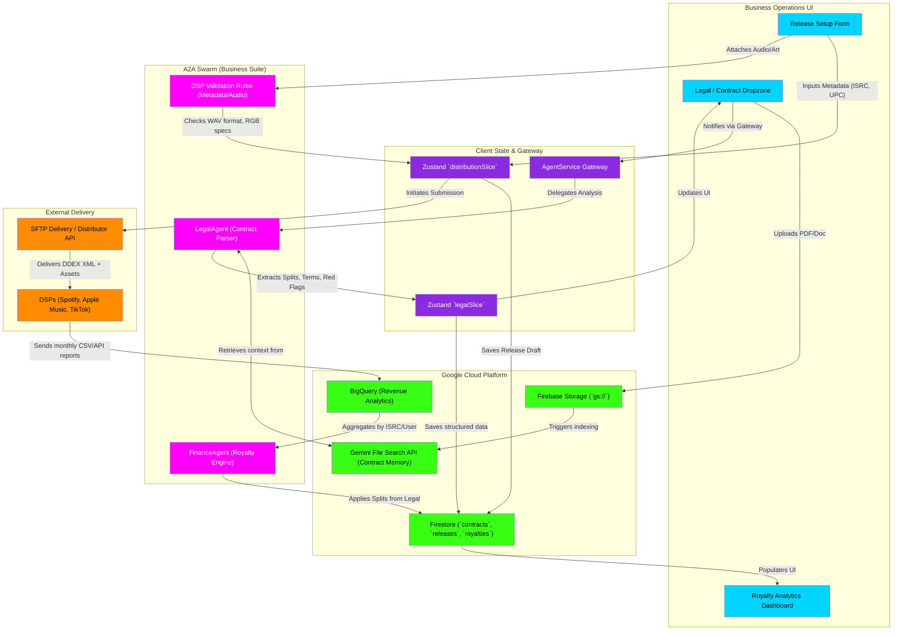

# Distribution, Legal & Royalties Flowchart

This flowchart maps the business operations lifecycle within indii. It details how the LegalAgent parses contracts (splits, record deals), how distribution assets are validated for DSPs (Digital Service Providers like Spotify/Apple Music), and how royalty tracking connects to the global state.

## Transition Breakdown

1. **Contract Ingestion:** A user uploads a music industry contract (PDF) into the **Legal / Contract Dropzone**. The file is uploaded to **Firebase Storage** and immediately indexed by the **Gemini File Search API** for native RAG capability.
2. **AI Legal Parsing:** The **AgentService Gateway** routes the request to the **LegalAgent**. The LegalAgent natively queries the File Search API to read the document. It uses its deterministic tools to extract strict numerical splits, terms, and potential "red flag" clauses (e.g., perpetual rights).
3. **Structured Persistence:** The parsed JSON data updates the **Zustand `legalSlice`** and is securely saved to **Firestore** `contracts` collection.
4. **Distribution Setup:** The user prepares a release via the **Release Setup Form**. They input required metadata (ISRC, UPC) and attach WAV masters and 3000x3000px artwork.
5. **Asset Validation:** Before submission, the **DSP Validation Rules** engine strictly checks the assets (e.g., rejecting CMYK images or MP3s instead of WAVs), saving valid drafts to the **Zustand `distributionSlice`** and **Firestore**.
6. **Delivery:** Once finalized, the system packages the metadata into DDEX XML format and uses **SFTP Delivery** to push the assets to global **DSPs** (Spotify, Apple Music).
7. **Royalty Aggregation:** Months later, DSPs return massive CSV files of micro-penny streams. These are ingested into **BigQuery** for high-volume analytics.
8. **Split Enforcement:** The **FinanceAgent** reads the BigQuery aggregates and cross-references them with the contract splits saved in Firestore by the LegalAgent. It computes the net earnings per collaborator and populates the **Royalty Analytics Dashboard**.
