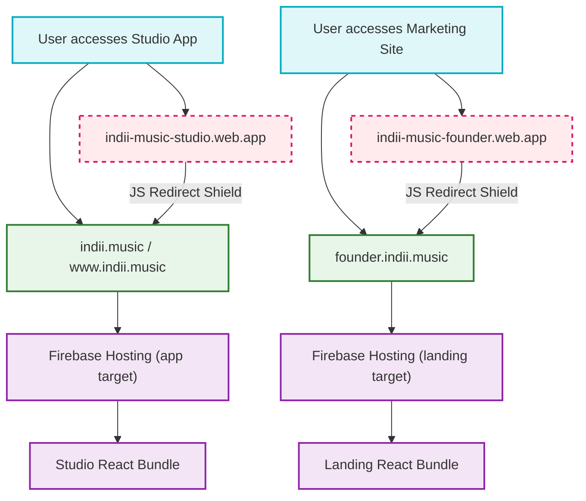

# Domain Redirect Architecture

Purpose: Maps the multi-domain hosting environment in Firebase and how the Javascript Redirect Shield forces all default `.web.app` traffic onto the canonical custom domains.

## Transition Breakdown

1. **Default Domains (Red Dashed):** Firebase automatically provisions `.web.app` and `.firebaseapp.com` domains. These are treated as "dirty" URLs that users should never see.
2. **Javascript Redirect Shield (Orange):** Because `firebase.json` cannot conditionally redirect based on hostname (only path), a lightweight JS script executes in `<head>` before React mounts. If it detects a `.web.app` or `.firebaseapp.com` host, it executes `window.location.replace()` to the canonical custom domain, preserving path and query parameters.
3. **Canonical Domains (Green):** The only domains that actually serve the React bundle to the DOM.
4. **Console Configuration:** `www.indii.music` is explicitly mapped via Firebase Console to 301 redirect to `indii.music` at the DNS/CDN level to prevent the JS shield from even needing to fire for `www` typos.
