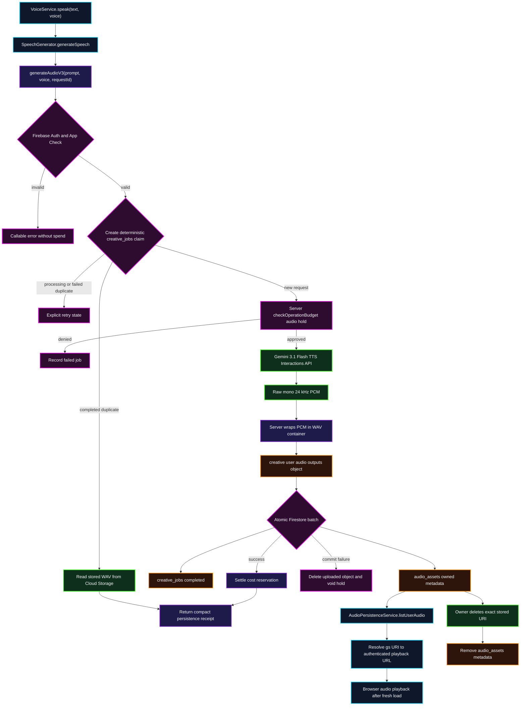

# Durable Cloud Audio Pipeline

This micro-flow maps the production TTS request from the active renderer caller through cost control, Gemini, Cloud Storage, Firestore, reload playback, retry replay, and owner deletion.

## Transition breakdown

1. `VoiceService.speak()` calls `SpeechGenerator.generateSpeech()`. The renderer creates a UUID `requestId` and sends only `prompt`, a validated voice name, and that ID to `generateAudioV3`.
2. The callable authenticates the user and derives a deterministic job ID from the user ID plus request ID. A new request exclusively creates its `creative_jobs` claim; a duplicate completed request reads and returns the existing WAV instead of generating or reserving again.
3. The server estimates TTS spend from prompt input tokens and buffered audio duration, then calls `checkOperationBudget()` with operation type `audio`. Generation cannot start without an approved server-owned reservation.
4. The callable invokes the documented Gemini 3.1 Flash TTS Interactions contract. Gemini returns raw mono PCM; the server writes a standards-compliant 16-bit WAV header before persistence so browsers receive playable audio.
5. Cloud Storage receives the WAV under `creative/{uid}/audio/outputs`. A single Firestore batch marks `creative_jobs` completed and creates the owned `audio_assets` record. If that batch fails, the uploaded object is deleted and the reservation is voided.
6. On success, the reservation is settled and the callable returns only `libraryAssetId` and `resultUri`; the renderer resolves the stored object for immediate playback without expanding audio into a base64 callable payload. If immediate settlement fails, scheduled reconciliation checks the durable job and settles completed output rather than refunding it.
7. After a fresh app load, `AudioPersistenceService.listUserAudio()` queries only the authenticated owner's records and resolves each `gs://` URI to an authenticated playback URL.
8. Deletion uses the exact persisted Storage URI. Storage rules separately authorize owner deletion while retaining MIME and size validation for creates/updates; metadata is removed only after Storage deletion succeeds.
9. Any repeated verification failure follows the shared two-strike rule: after two failures, abandon the current patch path and re-diagnose the deployed boundary rather than layering another local workaround.
