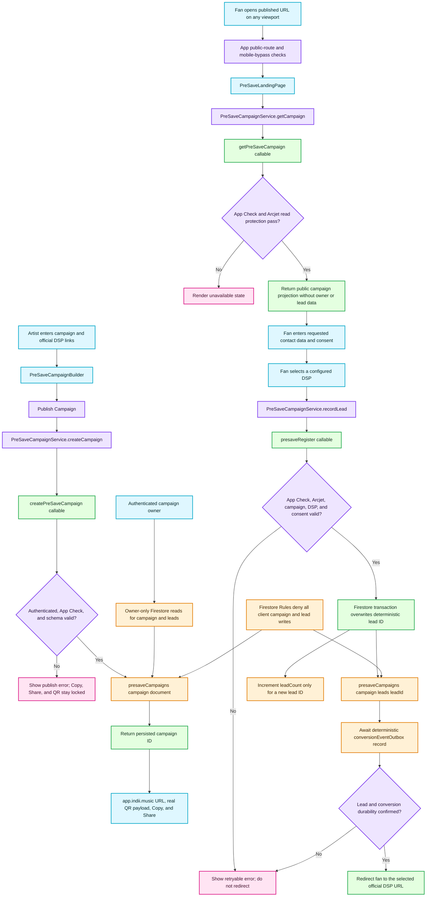

# Durable Pre-Save Campaign Flow

This diagram documents the production pre-save path from artist publication through consented fan-lead persistence and DSP handoff. It also identifies the gates that prevent a share link or redirect from appearing before the underlying data is durable.

## Transition breakdown

1. The artist supplies a title, release date, optional cover art, collection preferences, and at least one official HTTPS DSP URL. The builder does not derive a public campaign identifier locally.
2. `PreSaveCampaignService.createCampaign` invokes `createPreSaveCampaign`. The callable requires an authenticated user and App Check, validates the full campaign shape and official DSP domains, and writes the campaign with the Admin SDK.
3. Only the Firestore-generated campaign ID unlocks the canonical `https://app.indii.music/presave/{campaignId}` URL, its QR encoding, and Copy/Share actions. Failed or dirty publications stay unshareable.
4. `App.tsx` recognizes the pre-save route before authentication, and the mobile routing policy exempts it from the Controller surface. A phone therefore reaches the same public landing page as a desktop browser.
5. The landing page loads a callable-produced public projection. Owner identity, lead count, timestamps, and fan data never enter the public response.
6. When contact capture is configured, the fan must provide the requested fields and explicit marketing consent before a DSP action can proceed.
7. `presaveRegister` applies App Check and fail-closed Arcjet protection, validates the live campaign and selected configured DSP, then writes `leads/{leadId}` transactionally. Repeating the same lead ID overwrites that document and does not increment `leadCount` again.
8. The callable awaits a conversion-outbox write whose event ID is deterministically derived from the lead ID. Only confirmed lead and conversion durability returns success; otherwise the page remains in place with a retryable error.
9. Firestore Rules let the authenticated campaign owner read their own campaign and leads, while every client-side create, update, or delete is denied. All trusted writes therefore pass through the validated callables.
