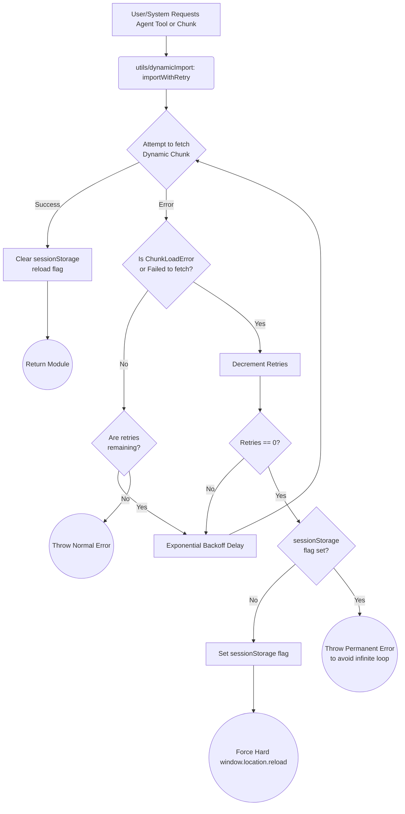

# Dynamic Import Chunk Error Recovery Macro

This flowchart illustrates the unified recovery flow for dynamically imported modules and agent tools, preventing dead-ends on stale-chunk 404 errors post-deployment.

## Step-by-Step Transition Breakdown

- **Start to ImportRequest**: An agent or tool is lazy-loaded, passing through the unified `importWithRetry` helper.
- **ImportRequest to TryFetch**: Transient network errors are retried with exponential backoff.
- **TryFetch to CheckError**: If the error is a systemic `ChunkLoadError` (meaning a new deployment has wiped the old chunk hash from the server), we evaluate the retries.
- **CheckError to Decrement**: If retries run out, the utility checks a `sessionStorage` guard.
- **FlagCheck to HardReload**: If no reload has occurred yet, it performs a hard page reload to fetch the new `index.html` and the updated chunk hashes.
- **FlagCheck to AbortLoop**: If a reload already occurred but the chunk still fails, it breaks the loop and throws a permanent error so the application does not get stuck in an infinite reload cycle.
