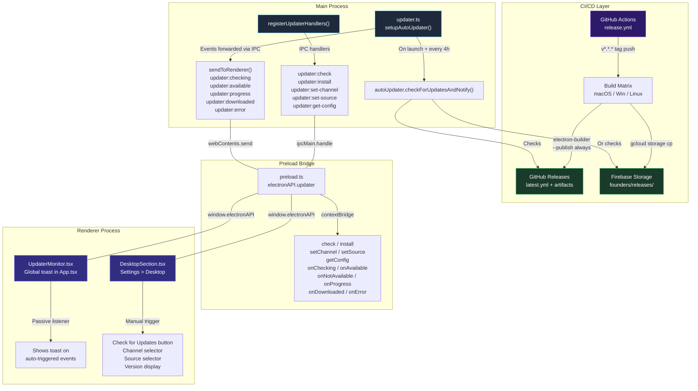
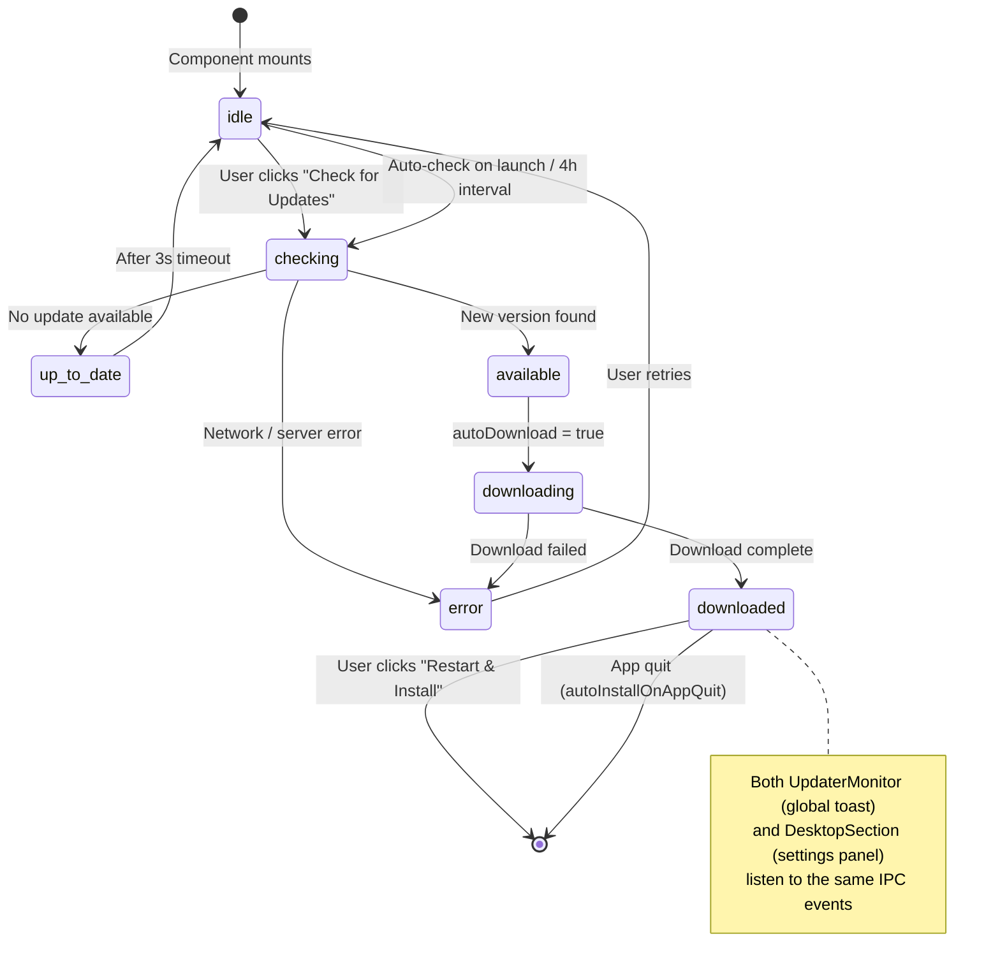

# Electron Auto-Update System — Architecture Flowchart

> Generated for the Desktop & Updates settings section implementation.

## System Overview

## Update Lifecycle — State Machine

## File Ownership Map

| Layer | File | Responsibility |
|-------|------|---------------|
| **CI/CD** | `.github/workflows/release.yml` | Builds all platforms, publishes to GitHub Releases + Firebase Storage |
| **Main** | `packages/main/src/updater.ts` | `electron-updater` config, auto-check scheduling, IPC handlers, system notifications |
| **Main** | `packages/main/src/main.ts` | Calls `registerUpdaterHandlers()` (unconditional) + `setupAutoUpdater()` (production only) |
| **Bridge** | `packages/main/src/preload.ts` | Exposes `electronAPI.updater` via `contextBridge` |
| **Types** | `packages/renderer/src/types/electron.d.ts` | TypeScript interface for `ElectronAPI.updater` |
| **UI (Passive)** | `packages/renderer/src/core/components/UpdaterMonitor.tsx` | Global floating toast — reacts to auto-triggered update events |
| **UI (Active)** | `packages/renderer/src/modules/settings/settings-panel/DesktopSection.tsx` | **NEW** — Manual check button, channel/source config, version display |
| **UI (Shell)** | `packages/renderer/src/modules/settings/SettingsPanel.tsx` | Routes to DesktopSection via sidebar nav |

## IPC Channel Reference

| Channel | Direction | Purpose |
|---------|-----------|---------|
| `updater:check` | Renderer → Main | Manual update check (returns `{ available, version }`) |
| `updater:install` | Renderer → Main | Trigger `quitAndInstall()` |
| `updater:set-channel` | Renderer → Main | Switch stable ↔ beta (persisted in `electron-store`) |
| `updater:set-source` | Renderer → Main | Switch GitHub ↔ Firebase feed URL |
| `updater:get-config` | Renderer → Main | Get current channel + source + availability |
| `updater:checking` | Main → Renderer | Update check started |
| `updater:available` | Main → Renderer | New version found (includes version string) |
| `updater:not-available` | Main → Renderer | Already on latest |
| `updater:progress` | Main → Renderer | Download progress (percent, speed, transferred, total) |
| `updater:downloaded` | Main → Renderer | Download complete, ready to install |
| `updater:error` | Main → Renderer | Error during check or download |
