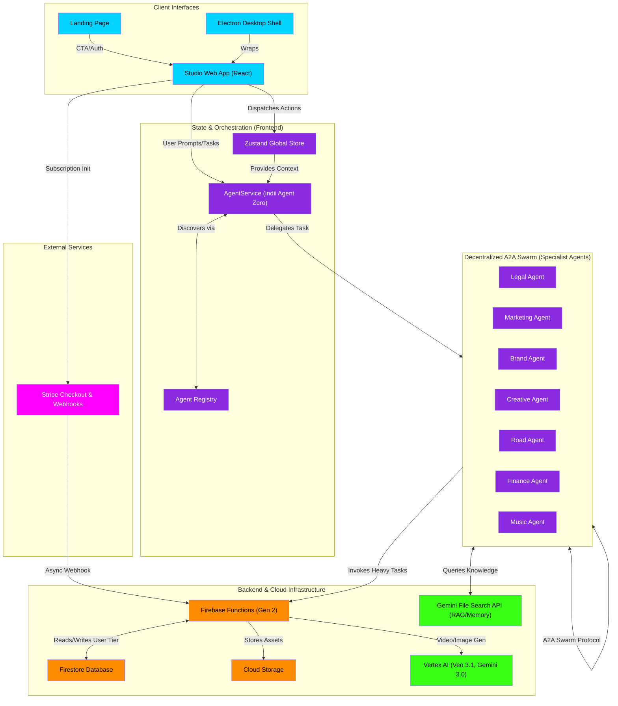

# Entire App Architecture Flowchart

This macro flowchart depicts the high-level system architecture of indii. It illustrates the interaction between client interfaces, the frontend orchestration layer, the decentralized A2A (Agent-to-Agent) Swarm of specialist agents, and the backend cloud infrastructure powered by Firebase and Vertex AI.

## Transition Breakdown

1. **User Entry & Interaction:**
   Users enter the platform via the **Landing Page (LP)** and transition to the **Studio Web App (SA)**. Alternatively, they use the **Electron Desktop Shell (ES)**, which wraps the Studio app natively. The Studio dispatches UI events to the **Zustand Global Store (ZS)** and forwards complex AI requests to the **AgentService (AS)**.

2. **Context Injection & Orchestration:**
   The **AgentService (indii Agent Zero)** retrieves the current brand kit, user tier, and project metadata from the **Zustand Global Store (ZS)**. Before delegating tasks, it consults the **Agent Registry (AR)** to discover available specialist capabilities.

3. **Delegation & Swarm Collaboration:**
   The Orchestrator delegates the problem to the appropriate **Specialist Agent** (e.g., Creative, Legal, Finance). Once initiated, specialists can communicate directly with each other via the **A2A Swarm Protocol** without returning to the Orchestrator. 

4. **Knowledge Retrieval:**
   To inform their decisions and maintain project memory, Specialist Agents query the **Gemini File Search API (FileSearch)** natively, replacing the legacy RAG systems and ensuring long-context persistence.

5. **Heavy Task Offloading:**
   For high-compute operations like video and image generation, agents do not rely on client-side AI. They invoke **Firebase Functions (FF)**. 

6. **Cloud Execution & Persistence:**
   The Cloud Functions act as the secure backend barrier. They verify user quotas via the **Firestore Database (FS)** before triggering generation on **Vertex AI (Vertex)**. Once assets are generated, they are securely saved to **Cloud Storage (CS)** and referenced back in Firestore.

7. **Billing Lifecycle:**
   When a user initiates an upgrade from the UI, it routes to **Stripe Checkout (Stripe)**. Stripe processes the payment and fires an async webhook to **Firebase Functions (FF)**, securely updating the user's tier in the **Firestore Database (FS)**, which propagates live to the client state to unlock features immediately.
