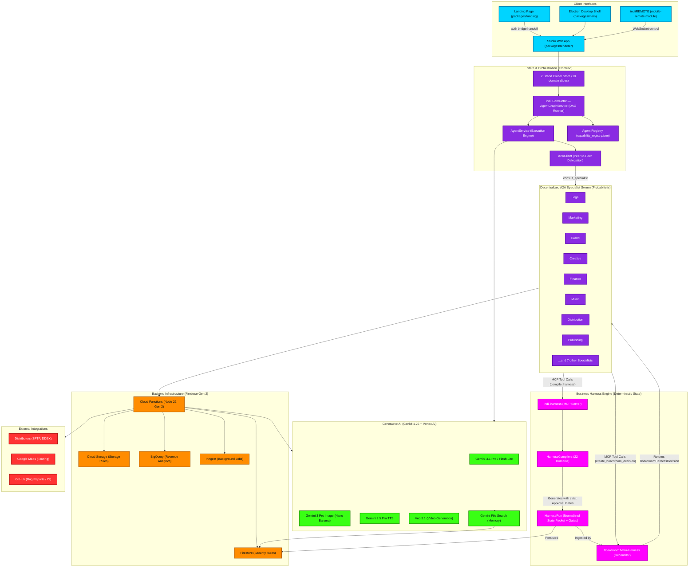

# Entire App Architecture Flowchart

This macro flowchart depicts the high-level system architecture of **indii** — the AI-native music business platform. It maps the interaction between client interfaces, the frontend orchestration layer (**indii Conductor** + A2A swarm), the **Deterministic Business Harness Engine**, the Firebase Gen 2 backend, the Genkit generative stack, and external integrations.

## Transition Breakdown (Updated)

1. **Entry & Auth (Client → State):** A user enters via Landing, Studio Web App, Desktop Shell, or indiiREMOTE. All client surfaces hydrate the **Zustand Global Store**.
2. **Orchestration Dispatch (State → Conductor):** A user request flows into the **indii Conductor** (AgentGraphService). The Conductor queries the Agent Registry before planning execution graphs.
3. **Delegation (Conductor → Specialist Swarm → A2AClient):** Conductor orchestrates specialist agents via AgentRegistry, utilizing A2AClient to dispatch P2P requests with scope-guards.
4. **Deterministic Harness Generation (Swarm → Harness Engine):** *[NEW]* Probabilistic Swarm Agents DO NOT invent execution readiness. They invoke the **`indii-harness` MCP Server**, executing deterministic **HarnessCompilers** for their respective domains. This outputs a normalized **HarnessRun** packet with attached, immutable Approval Gates (Draft, User Required, Attorney Required).
5. **Cross-Domain Reconciliation (HarnessRuns → Boardroom):** *[NEW]* When domains conflict (e.g., Marketing urgency vs Legal blocks), agents utilize the MCP to invoke the **Boardroom Meta-Harness**. This engine ingests all relevant `HarnessRun` packets and resolves priorities (Legal/Security always overrides optimism), emitting a final strategic decision with rigid source citations.
6. **Backend Execution (Swarm → Cloud Functions):** Only after Harness states are compiled and gated, side-effectful work (DDEX delivery, Founder checkout, persistence) delegates to **Cloud Functions**, which write to Firestore/Storage.
7. **Generative AI (Cloud/Orchestration → AI):** Genkit and Vertex AI models handle creative output, audio synthesis, and conversational logic. The Gemini File Search API provides memory via Firestore embeddings.
8. **External Integrations (Cloud → External):** Cloud Functions handle final hand-offs to manual payment verification, DDEX Distributors, GitHub, and Maps. Any execution lacking proper Approval Gates is hard-rejected.
