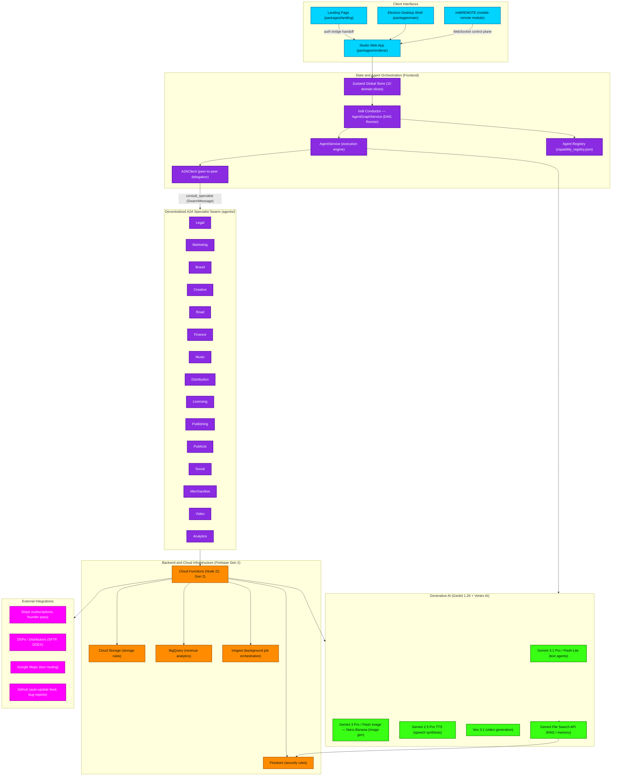

# Entire App Architecture Flowchart

This macro flowchart depicts the high-level system architecture of **indii** — the AI-native music business platform. It maps the interaction between client interfaces, the frontend orchestration layer (**indii Conductor** + the decentralized A2A specialist swarm), the Firebase Gen 2 backend, the Genkit/Vertex AI generative stack, and external integrations. Verified against the live codebase (`packages/renderer/src/core/App.tsx`, `constants.ts`, `services/agent/orchestration/AgentGraphService.ts`, `core/config/intelligence-models.ts`).

## Transition Breakdown

1. **Entry & auth (Client → State).** A user enters through the **Landing Page** (`packages/landing`), the **Studio Web App** (`packages/renderer`), the **Electron Desktop Shell** (`packages/main`), or **indiiREMOTE** (the `mobile-remote` module). The landing page hands a signed session to the studio via the auth bridge; the desktop shell wraps the same renderer; indiiREMOTE drives it over a WebSocket control plane. All client surfaces hydrate the **Zustand Global Store** (10 domain slices: app, auth, agent, creative, distribution, fileSystem, finance, profile, workflow, audioIntelligence).

2. **Orchestration dispatch (State → Conductor).** A user request flows from the store into the **indii Conductor** (`AgentGraphService` — the DAG runner that replaced the legacy AgentZeroService). The Conductor reads the **Agent Registry** (`capability_registry.json`) to discover which specialist capabilities are available before planning a graph.

3. **Execution & delegation (Conductor → AgentService → A2AClient).** The Conductor invokes **AgentService** (the execution engine) to run graph nodes. For cross-domain work, AgentService uses the **A2AClient** to dispatch a `SwarmMessage` via the `consult_specialist` tool, with conversation-mode scope guards (DIRECT_MODE_NO_DELEGATION / DEPARTMENT_SCOPE_VIOLATION) validating whether delegation is permitted.

4. **Specialist swarm (A2A → Swarm).** The 15 domain specialists (`agents/`) execute autonomously and in parallel — Legal, Marketing, Brand, Creative, Road, Finance, Music, Distribution, Licensing, Publishing, Publicist, Social, Merchandise, Video, Analytics — each emitting a `SwarmResponse` that the Conductor consolidates.

5. **Backend execution (Swarm → Cloud Functions).** Side-effectful work (payments, distribution uploads, persistence, analytics) is delegated to **Firebase Cloud Functions** (Node 22, Gen 2), which read/write **Firestore** and **Cloud Storage** (both gated by security rules), stream revenue events to **BigQuery**, and schedule long-running jobs via **Inngest**.

6. **Generative AI (AgentService/Cloud → AI).** Both the frontend agents and Cloud Functions call the **Genkit + Vertex AI** stack with the only approved models (`intelligence-models.ts`): Gemini 3.1 Pro/Flash-Lite for text, Gemini 3 Pro/Flash Image ("Nano Banana") for images, Gemini 2.5 Pro TTS for speech, and Veo 3.1 for video. The **Gemini File Search API** provides RAG/memory, persisting embeddings back to Firestore.

7. **External integrations (Cloud → External).** Cloud Functions integrate with **Stripe** (subscription billing + founder-pass activation), **DSPs/distributors** (SFTP + DDEX delivery), **Google Maps** (tour distance/routing), and **GitHub** (desktop auto-update feed + in-app bug reporting) — all now pointed at the `indii-music-founder/indii-music-founder` repository.

**Fallback / gate logic:** If a provider is unconfigured, Cloud Functions surface a `failed-precondition` error rather than a silent fallback. Delegation that violates conversation-mode scope is rejected at the A2AClient boundary before any specialist runs. Security-rule denials short-circuit at the Firestore/Storage layer regardless of frontend state.
