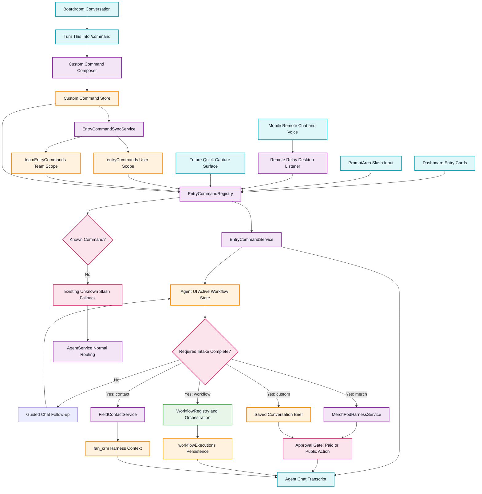

# Entry Card Slash Workflows

This flowchart maps the Universal Command Workflow Layer. The same command backbone handles dashboard cards, typed slash commands, mobile remote messages, voice/dictation text, future capture shortcuts, and custom slash commands promoted from useful Boardroom conversations.

## Transition Breakdown

1. A workflow can start from a dashboard card, typed slash command, mobile remote message, dictated phone text, or a future capture shortcut.
2. `EntryCommandRegistry` resolves known commands and defines aliases, surfaces, intake fields, harness/workflow mappings, approval requirements, output contracts, and resume behavior.
3. Custom commands are stored separately from built-ins, saved locally first, and mirrored to user/team Firestore scopes when authenticated. Built-in slash names remain reserved.
4. `EntryCommandService` creates user-visible transcript messages, stores active intake state, extracts answers, and asks follow-up questions when required fields are missing.
5. `/save-command` and natural phrases like "turn what we just did into a workflow command called /shirt" summarize recent conversation context into a reusable command definition.
6. `/capture-contact` uses messy natural text to create a `FieldContactService` record under the user's field contacts. Only the name is required, and outreach remains approval-gated.
7. `/tour-merch` and custom merch commands compile a `merch_pod` harness quote with provider, product, cost, margin, and approval gates. They do not submit samples, orders, storefronts, SMS, or email.
8. Other command workflows collect structured context and can hand off to `WorkflowRegistry` and persisted `workflowExecutions` as their domain implementations deepen.
9. Unknown slash commands still fall back to the existing slash-command behavior, preserving previous developer workflows.
10. Normal chat bypasses the command layer unless a command workflow is actively collecting intake.
