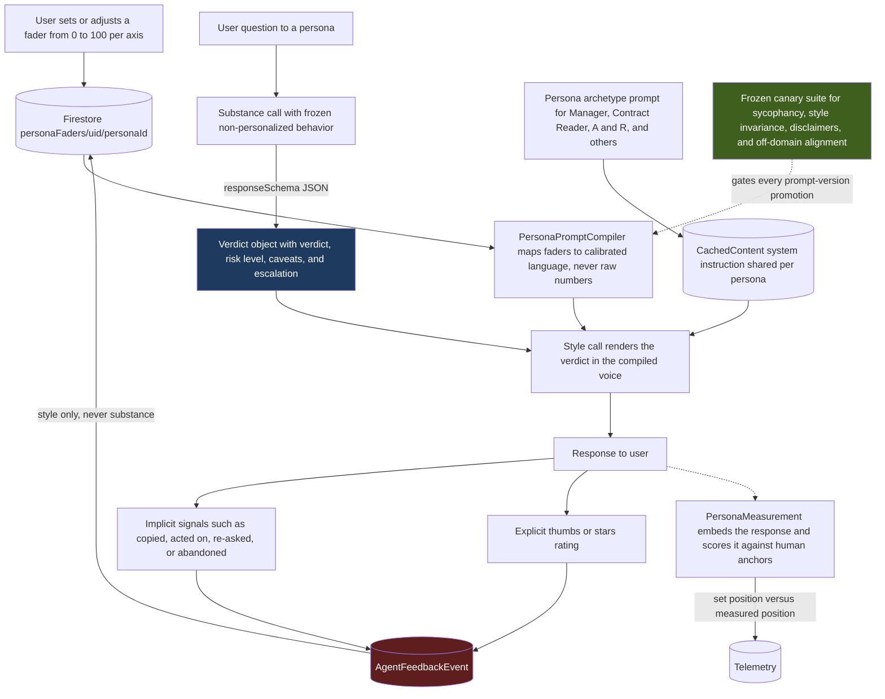

# Evolas T1 — Macro Architecture

Scope: `docs/EVOLAS_BUILD_PLAN.md` Phase T1 only. This is the style/substance
split with fader-driven prompt compilation, cached at the persona level,
measured against human anchor texts. No fine-tuning, no bandit, no per-user
weight changes anywhere in this diagram.

## Transition Breakdown

- **Substance call and style call are separate API calls.** The style call
  never receives the raw user question — only the already-computed verdict
  object plus the compiled persona voice. It has nothing to delete a caveat
  *from*, because it never had the caveat's source material.
- **Ratings write to Firestore's fader document, not to any model weights.**
  There is no arrow from `FB` to a training/tuning step anywhere in this
  diagram, because Phase T1 (and T2, and T3 per the non-negotiables) has
  no such step.
- **The canary suite sits between the compiler and shipping a new prompt
  version** — it gates promotion, it does not gate individual requests.
- **Cache is keyed by persona, not by user.** The per-user fader block is
  assembled outside the cached prefix so cost stays flat as users scale.

## Out of scope for this diagram

T2 (bandit over fader positions, best-of-3 re-ranking) and T3 (distillation,
aggregate preference tuning, self-hosted Gemma) are separate phases with
their own gates — see `docs/EVOLAS_BUILD_PLAN.md`. Not diagrammed here to
keep this macro view scoped to what's actually being built next.
