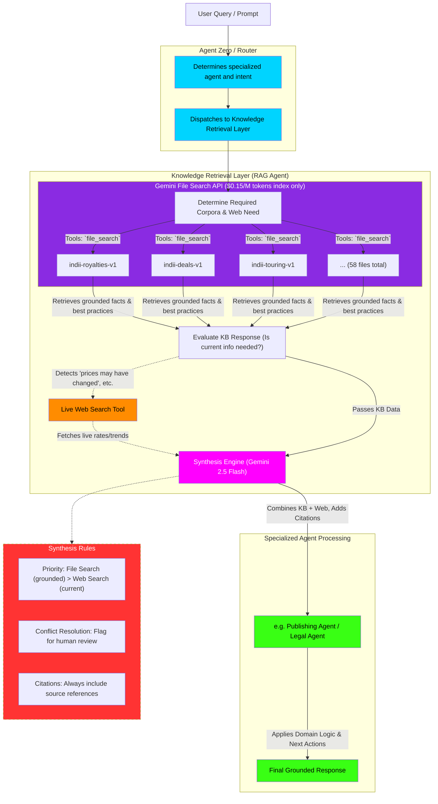

# File Search RAG Implementation Flowchart

This flowchart maps the Knowledge Retrieval Layer using Google's Gemini File Search API. It illustrates how user queries are routed through the RAG Agent, synthesized with live Web Search data, and formatted with citations for the specialized Swarm Agents.

## Transition Breakdown

1. **Routing:** `Agent Zero` receives the user query and determines which specialized agent is needed (e.g., the Publishing Agent). Before the agent acts, it dispatches the query to the Knowledge Retrieval Layer.
2. **Corpora Selection:** The RAG Agent determines which of the 12 knowledge bases (Corpora) to query (e.g., `indii-royalties-v1` and `indii-deals-v1`) by dynamically adding them as `file_search` tools.
3. **Grounded Retrieval:** The system queries the Gemini File Search API, retrieving grounded facts, templates, and best practices directly from the indexed markdown files.
4. **Currency Evaluation:** The system evaluates the response. If it detects phrases indicating missing current information (e.g., "as of my last update" or "check current rates"), it triggers the **Live Web Search Tool**.
5. **Synthesis:** The Synthesis Engine (Gemini 2.5 Flash) takes the grounded KB response and the live Web Search results and merges them. It strictly prioritizes the internal knowledge base for facts but uses the web for real-time data (like current royalty percentages).
6. **Final Processing:** The fully synthesized, highly factual context—complete with hard citations—is passed to the specialized agent (e.g., the Publishing Agent), which then outputs the final response to the user along with suggested next actions.
