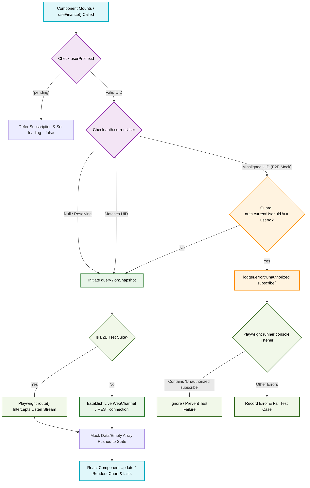

# Finance Data Subscription Guard Flowchart

This flowchart maps the lifecycle of the `useFinance` hook subscriptions, detailing the initialization safeguards and E2E authentication/mocking error bypass mechanisms.

## Transition Breakdown

1. **Onboarding / Initial State Guard:** When the application first loads, the user profile in the Zustand store is initialized with `id: 'pending'`. The `useFinance` hook intercept catches this pending state in its `useEffect` dependencies, preventing it from invoking `subscribeToEarnings` or `subscribeToExpenses` with the mock identifier.
2. **Authentication Guard:** Once the profile resolves to a valid UID, it is cross-referenced with `auth.currentUser`. Under normal operational parameters, these match, and a live Firestore listener is established via `onSnapshot`.
3. **E2E Emulation Guard:** During direct-navigation E2E specialist tests, the auth state can momentarily desynchronize from the mock profile ID. If a misalignment triggers, `FinanceService` issues an unauthorized log message. The Playwright console listener in `live_tests_runner.spec.ts` intercepts this message, filters it out to prevent false-positive failures, and allows the test to verify visual layout integrity under mock conditions.
