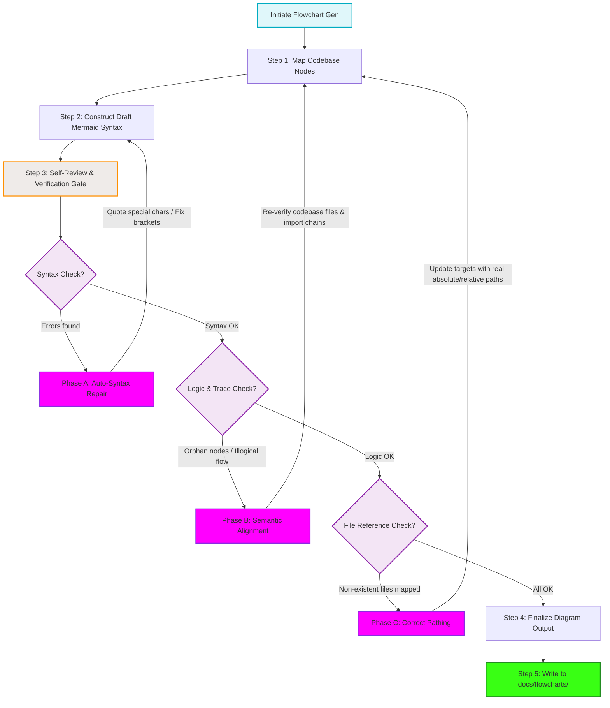

# Flowchart Self-Review and Self-Healing Architecture

This diagram maps the new "Self-Review and Self-Healing" flow within the `/flowchart` command. It details how the agent identifies conceptual gaps, checks Mermaid syntax validity, and automatically repairs mistakes.

## Step-by-Step Transition Breakdown

1. **Syntax Integrity Verification (`D1 -> E -> C`):** The agent runs a quick regex/lint audit on the generated Mermaid code. If brackets are unclosed, or node IDs have unquoted special characters (e.g. `(`, `)`, `-`), `Phase A` fires to clean syntax before compile.
2. **Semantic Verification (`D2 -> F -> B`):** The agent reviews the trace. Do nodes hang without inputs or outputs? Does the flow represent a logical request/response cycle? If not, `Phase B` aligns the diagram to match actual directory execution.
3. **Absolute File Verification (`D3 -> G -> B`):** Mapped codebase files (e.g. `packages/renderer/src/services/UserService.ts`) are cross-referenced with the filesystem. If they are non-existent, `Phase C` updates them.
4. **Final Registry Write (`I`):** The final polished, error-free flowchart is saved strictly inside `docs/flowcharts/` for maximum searchability by the swarm.
