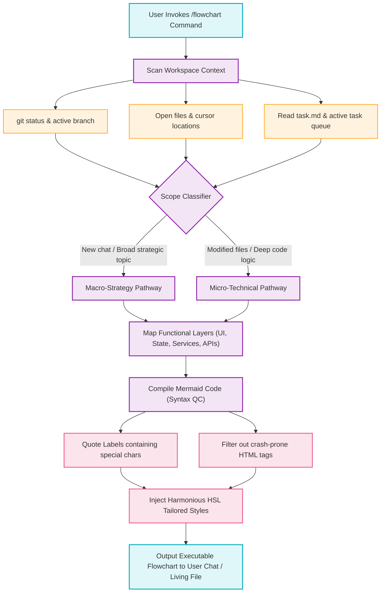

# Flowchart Workflow Execution Logic Flowchart

This technical flowchart details the internal logical process of the `/flowchart` command. It documents how the active context (git tree, open files, active tasks) is scanned, how the classification layer selects the diagram detail level (macro vs. micro), and the subsequent compiling, formatting, and rendering pipeline.

---

## Mermaid Diagram

---

## Step-by-Step Transition Breakdown

1. **Trigger Input:** The user invokes the `/flowchart` slash command in the chat interface, requesting a visual blueprint of the architecture, workflow, or system flows.
2. **Ecosystem Inspection:** The agent scans the current active workspace. It reads:
   - **Repository State:** Branch info, uncommitted code blocks, and files with local diffs using `git status`.
   - **User Interface State:** The active open tabs, files, and where the developer's cursor is currently located.
   - **Task Context:** The active milestone in `task.md` or active blockages in the `task-queue.json` queue.
3. **Scope Classification:** The classifier dynamically determines the context depth:
   - **Macro Pathway:** Chosen if the workspace is clean, the session is fresh, or the user asks a broad architectural or strategic question.
   - **Micro Pathway:** Chosen if the developer has modified specific technical files, or is actively debugging or implementing complex code layers.
4. **Functional Layer Mapping:** The agent maps the system entities across functional layers (UI components, global stores, logic services, cloud databases, external integrations) to ensure complete alignment with the project directory structure.
5. **Mermaid Compiling & Verification:** The text is compiled into Mermaid syntax. To prevent syntax errors and parser crashes, it runs through two automatic verification filters:
   - **Quotes Enforcement:** Node labels containing special characters, brackets, or parentheses are encapsulated in quotes.
   - **HTML Prevention:** The compiler strips out crash-prone HTML tags (such as ` ` or `<b>`).
6. **HSL Style Injection:** The compiler applies premium, Harmonious HSL styled colors to classes corresponding to each layer (UI, Services, DBs, Cloud APIs, error gates).
7. **Final Delivery:** The resulting markdown file containing the formatted flowchart and this detailed breakdown is output in the chat interface or saved directly to `docs/flowcharts/` for engineering and strategic review.
