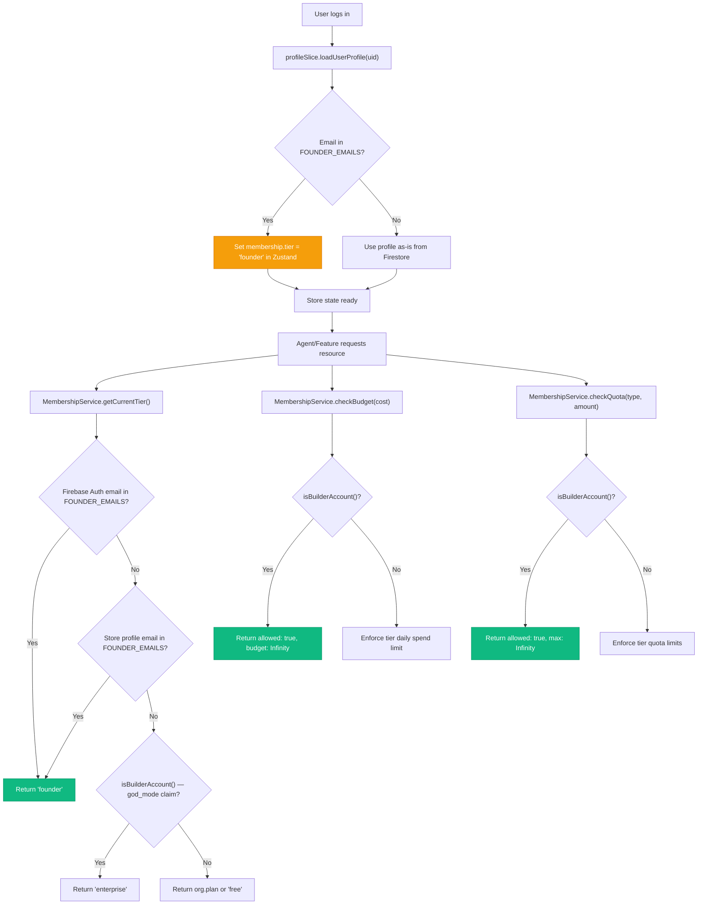
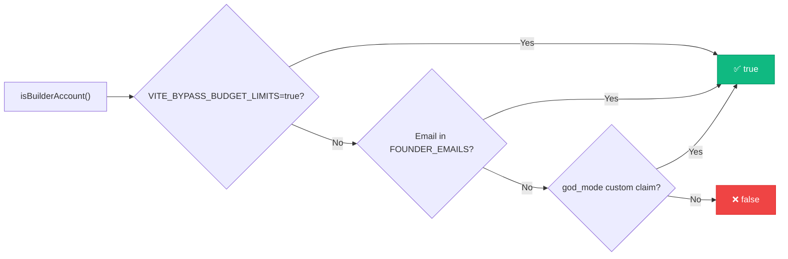

# Founder Access Bypass — Tier Resolution Flowchart

## Overview

This flowchart documents the cascading bypass logic that grants the platform owner (`wiil@indii.music`) Founder-tier access across all enforcement layers in the membership system.

---

## Tier Resolution Flow

## isBuilderAccount() Priority Chain

## Enforcement Points

| Enforcement Layer | Method | Founder Behavior |
|---|---|---|
| **Tier Resolution** | `getCurrentTier()` | Returns `'founder'` — $500/day, 10TB, unlimited projects |
| **Budget Gate** | `checkBudget()` | `allowed: true`, `remainingBudget: Infinity` |
| **Quota Gate** | `checkQuota()` | `allowed: true`, `maxAllowed: Infinity` |
| **Agent Circuit Breaker** | `BaseAgent._executeInternal()` | Skipped — budget check passes |
| **Profile Tier** | `profileSlice.loadUserProfile()` | Auto-set to `'founder'` in Zustand |

## Files Modified

- `packages/renderer/src/services/MembershipService.ts` — Core bypass logic
- `packages/renderer/src/core/store/slices/profileSlice.ts` — Auto-grant on load
- `packages/renderer/src/types/User.ts` — Type union update
