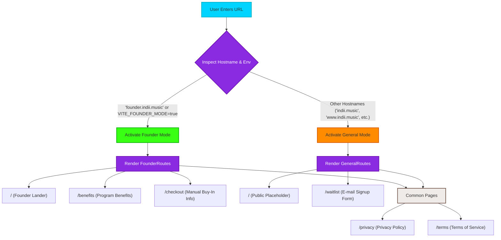

# Founder Dynamic Routing Flowchart

This flowchart visualizes the dynamic, hostname-based routing strategy implemented in the `landing` package. By inspecting the browser's current `hostname` at runtime (and supporting an environment override for local development), the application seamlessly switches between the $2,500 Founders Program application and a placeholder marketing site for the general public, sharing the same React build and codebase.

## Dynamic Routing Macro Architecture

## Step-by-Step Transition Breakdown

1. **User Action Layer (URL Access):**
   - The user triggers a request by navigating to a URL (e.g. `founder.indii.music`, `www.indii.music`, or `localhost:3000` during local testing).

2. **Routing Middleware Layer (Hostname & Env Check):**
   - In `packages/landing/src/App.tsx`, the application evaluates the boolean condition:
     `const isFounderMode = window.location.hostname.startsWith('founder') || import.meta.env.VITE_FOUNDER_MODE === 'true';`
   - This evaluation runs synchronously during the React mounting phase.

3. **Sub-Route Allocation:**
   - **Founder Mode Active:**
     - The React Router configuration switches to render the `<FounderRoutes />` component.
     - Contains premium custom styling, detail sheets, checkout instructions (manual buy-in), and deep benefits explanations.
   - **General Mode Active:**
     - The React Router configuration switches to render the `<GeneralRoutes />` component.
     - Serves as a standard, high-converting placeholder landing page with a waitlist or interest-capturing input form.
   - **Shared Components:**
     - Both router trees fall back to common informational pages like `/privacy` and `/terms`, minimizing duplication of legal resources.
