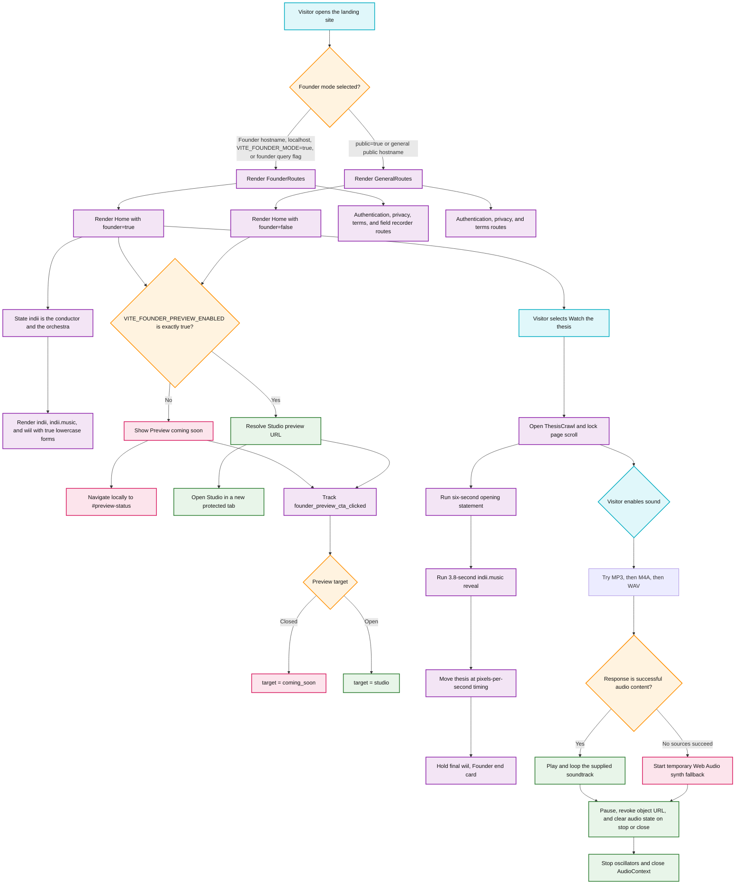

# Founder Marketing Routing, Preview Gate, and Thesis Flowchart

Purpose: Documents how the landing package selects the Founder experience, keeps product entry private by default, records preview intent, and runs the cinematic thesis with a replaceable soundtrack and safe fallback.

## Runtime Flow

## Transition Breakdown

1. **Select the route tree.** `packages/landing/src/App.tsx` evaluates `VITE_FOUNDER_MODE`, the current hostname, localhost, and the `founder=true` or `thesis=true` query flags. `public=true` is the explicit override. Founder mode renders `Home` with its default `founder=true`; public mode passes `founder=false`.
2. **Resolve product access fail-closed.** `packages/landing/src/lib/previewAccess.ts` returns `true` only when `import.meta.env.VITE_FOUNDER_PREVIEW_ENABLED === 'true'`. Missing, blank, or differently cased values remain closed. `packages/landing/src/lib/previewAccess.test.ts` proves both the default-closed and explicit-open cases.
3. **Keep closed CTAs useful.** When preview access is closed, both preview pills retain their visual weight and link to the local `#preview-status` section. No Studio URL, new tab, or application session is exposed. When access is explicitly enabled, `getStudioPreviewUrl()` supplies the external destination and the link adds `noopener noreferrer`.
4. **Record honest funnel intent.** Every preview click sends `founder_preview_cta_clicked` with its UI location and a target of either `coming_soon` or `studio`. Analytics therefore distinguish interest from actual product entry.
5. **State the product identity precisely.** The marketing Conductor section, thesis, preview sign-in copy, and in-app brand description all explain the same distinction: indii is both the conductor that receives the artist's direction and the connected orchestra that carries the work. The Conductor is not presented as a separate product.
6. **Protect the lowercase marks.** Visible uses spell `indii`, `indii.music`, and `wiil` exactly in lowercase. The `.indii-name` and `.wiil-name` treatments supply true lowercase glyphs and override inherited uppercase transforms without forcing surrounding labels into lowercase.
7. **Run the thesis sequence.** Opening `ThesisCrawl` locks background scrolling, resets the sequence, runs the opening statement for `6000` milliseconds, reveals the logo for `3800` milliseconds, then advances the crawl using elapsed frame time and `CRAWL_PIXELS_PER_SECOND`. Completion holds the signed end card rather than looping the animation.
8. **Resolve soundtrack sources safely.** Sound begins only after a visitor gesture. The component tries `/audio/indii-thesis-theme.mp3`, `.m4a`, and `.wav` in that order, confirms the response is successful and has an audio content type, then loops the first playable asset.
9. **Degrade and clean up.** If no supplied track can play, a temporary Web Audio synth is used. Pausing, muting, replaying, closing, or unmounting stops media, revokes object URLs, stops oscillators, closes the `AudioContext`, restores page scrolling, and prevents leaked audio resources.

## Verified Files

- `packages/landing/src/App.tsx`
- `packages/landing/src/page.tsx`
- `packages/landing/src/lib/previewAccess.ts`
- `packages/landing/src/lib/previewAccess.test.ts`
- `packages/landing/src/components/ThesisCrawl.tsx`
- `packages/landing/src/components/ConductorSection.tsx`
- `packages/landing/src/globals.css`
- `packages/renderer/src/services/agent/constants.ts`
- `agents/conductor/prompt.md`
- `directives/brand_voice_and_copy.md`
- `packages/landing/public/audio/README.txt`
- `packages/landing/vite.config.ts`
