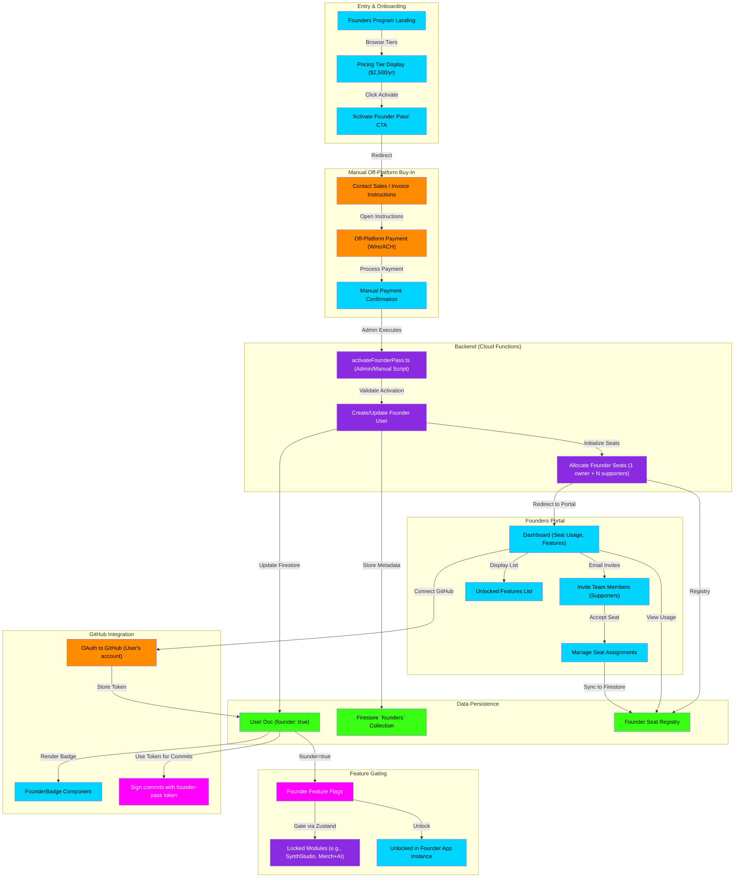

# Founders Checkout & Portal Flowchart

This flowchart maps the exclusive Founders Program—a paid feature tier where participating artists gain early access to indii's unreleased features, premium AI agents, and priority support. It details the checkout flow, seat management, and founders-only capability unlocking.

## Transition Breakdown

1. **Discovery:** User lands on the **Founders Program Landing Page** and sees pricing tiers (e.g., $2,500/yr).

2. **Checkout Initiation:** User clicks **"Activate Founder Pass"**. System directs them to **Contact Sales / Invoice Instructions** for an off-platform manual buy-in.

3. **Payment:** User completes an **Off-Platform Payment (Wire/ACH)** according to the instructions.

4. **Confirmation & Activation:** Upon manual payment confirmation, an admin executes the **`activateFounderPass.ts`** script.

5. **Backend Processing:** The admin script creates or updates the user's Firestore document with `founder: true`, and initializes the **Founder Seat Registry** (1 owner + N supporters).

6. **Portal Access:** User is redirected to the **Founders Portal Dashboard**, where they see:
   - **Seat Usage:** How many founder seats are in use
   - **Invite Team Members:** Email invites for supporters to join the founder account
   - **Manage Seats:** Reassign or revoke seats
   - **Unlocked Features:** A list of exclusive, beta-only modules now available

7. **Feature Gating:** All founder-exclusive features are gated by a **Founder Feature Flag** in the store. When a user has `founder: true`, the **Zustand store** flags unlock previously locked modules (e.g., advanced SynthStudio, Merch+AI).

8. **GitHub Integration:** From the Portal, user can connect their **GitHub account** via OAuth. The access token is stored in Firestore and used to:
   - Display the **Founder Badge** (visual indicator in UI and on GitHub profile)
   - Automatically sign commits to the user's repo with the founder-pass cryptographic key (ownership claim)

