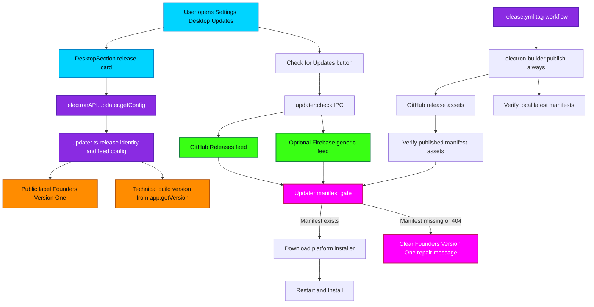

# Founders Version One Release Updater Flowchart

Purpose: maps the desktop release identity and auto-update path for the Founders Version One launch. The public app label starts at Founders Version One, while the technical Electron semver remains monotonic so installed builds newer than `v1.50.0` can update without being treated as a downgrade.

## Transition Breakdown

1. `DesktopSection.tsx` asks `electronAPI.updater.getConfig()` for the current channel, source, updater availability, public release label, founder release number, and technical build version.
2. `packages/main/src/updater.ts` returns `Founders Version One` as the human release identity and `app.getVersion()` as the semver value used by Electron updater. These must stay separate because Electron updater rejects lower versions when `allowDowngrade` is false.
3. Manual update checks call `updater:check`, which queries the active feed. GitHub Releases is the default source; Firebase remains selectable only when its generic feed is correctly published and public.
4. Missing manifest failures such as `latest-mac.yml` returning `404` are converted into a user-safe message explaining that the release needs repaired updater manifests.
5. `.github/workflows/release.yml` now blocks incomplete release jobs by verifying both the local manifest file and the published GitHub Release asset for each platform.
6. A release is not complete until the newer semver tag publishes platform artifacts and `latest-mac.yml`, `latest.yml`, and `latest-linux.yml` can be downloaded from the release asset URLs.
