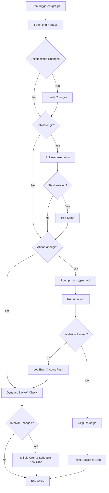

# Git Monitor Sync Architecture Flowchart

Below is the flowchart representing the Git Monitor & Sync loop system, showing how uncommitted changes are stashed, remote rebases are handled, pre-push validation (typecheck + vitest) is executed, and dynamic cron backoffs are updated.

## Transition Breakdown

1. **Change Detection:** Automatically performs a `git fetch` to evaluate the current branch relationship with the remote tracker.
2. **Rebase Sync:** Integrates remote changes cleanly. If uncommitted changes exist, they are stashed and then popped after rebase pull.
3. **Pre-Push Validation:** Runs all local typechecks and vitest unit tests before triggering a push. Any failure blocks the push to prevent breaking the remote branch.
4. **Dynamic Backoff Scheduling:** Automatically halves or resets the polling sequence, cancelling stale cron tasks and rescheduling updated intervals under the `schedule` API.
