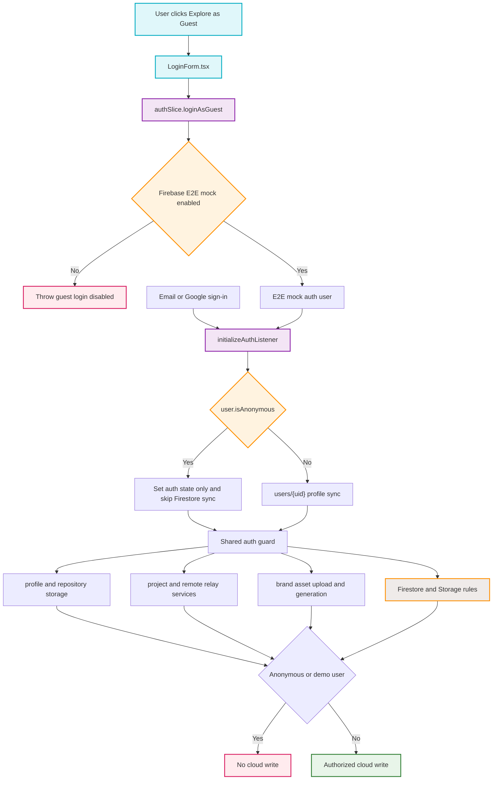

# Guest Auth Retirement Flowchart

Purpose: map the production path that currently creates anonymous Firebase users,
and the guarded target path that prevents guest sessions from touching cloud
state.

## Transition Breakdown

1. The visible guest control in `LoginForm.tsx` no longer routes production users
   into Firebase anonymous auth.
2. `authSlice.loginAsGuest()` becomes an explicit test/mock-only entry point.
   Outside Firebase E2E mock mode, it fails before calling
   `signInAnonymously()`.
3. The auth listener still accepts real email and Google users, but checks
   `user.isAnonymous` before syncing `users/{uid}`.
4. Existing anonymous sessions are treated as local-only state and must not
   trigger Firestore profile creation or last-login updates.
5. A shared guard keeps profile, storage, project, relay, brand asset, and rules
   logic consistent instead of relying on scattered `founder-demo-uid` checks.
6. Firestore and Storage rules should not grant anonymous guest write access.
   Any cleanup of already-created anonymous records remains a separate
   dry-run-first work order.
