# Image Generation Controls Contract

This micro flowchart maps the ISSUE-777 path from visible Image Creator settings through cost reservation, Firebase validation, Gemini generation, Cloud Storage persistence, and Creative Studio history.

```mermaid
flowchart TD
    User["User configures Image Creator controls"] --> DirectTab["DirectGenerationTab.tsx"]
    DirectTab --> Store["Zustand creativeControlsSlice"]
    Store --> DirectHook["useDirectGeneration.handleImageGenerate"]
    DirectHook --> RefUpload["CreativeStorageService uploads reference media"]
    RefUpload --> ImageService["ImageGenerationService.generateImages"]
    ImageService --> AuthGate{"Authenticated session and subscription quota valid?"}
    AuthGate -- "No" --> ClientError["Actionable client error and toast"]
    AuthGate -- "Yes" --> CostReserve["CostControlService reserves count × image cost"]
    CostReserve --> CostGate{"Approved reservation receipt exists?"}
    CostGate -- "No" --> ClientError
    CostGate -- "Yes" --> SharedSchema["GenerateImageSchema validates count, size, thinking, search, and response format"]
    SharedSchema --> Callable["generateImageV3 callable"]
    Callable --> ReservationGate{"Reservation belongs to user, is approved, and covers count?"}
    ReservationGate -- "No" --> ClientError
    ReservationGate -- "Yes" --> JobStart["creative_jobs status: processing"]
    JobStart --> GeminiLoop["Gemini request loop for requested image count"]
    GeminiLoop --> ProviderGate{"Every requested image generated?"}
    ProviderGate -- "No" --> Cleanup["Delete any written output objects"]
    Cleanup --> JobFail["creative_jobs status: failed"]
    JobFail --> Void["Void cost reservation"]
    Void --> ClientError
    ProviderGate -- "Yes" --> Storage["Write every image to Cloud Storage"]
    Storage --> StorageGate{"All Storage writes succeed?"}
    StorageGate -- "No" --> Cleanup
    StorageGate -- "Yes" --> JobComplete["creative_jobs status: completed with resultUris and metadata"]
    JobComplete --> Settle["Settle cost reservation"]
    Settle --> Results["ImageGenerationService resolves every stored URI"]
    Results --> History["Add every image to project-scoped generatedHistory"]
    History --> Editor["Select first image and open editor"]

    classDef ui fill:#071b2a,stroke:#00d4ff,color:#dffaff,stroke-width:2px
    classDef logic fill:#20103a,stroke:#8a2be2,color:#f2e8ff,stroke-width:2px
    classDef data fill:#2a1904,stroke:#ff8c00,color:#fff1d6,stroke-width:2px
    classDef cloud fill:#06240b,stroke:#39ff14,color:#e2ffe5,stroke-width:2px
    classDef gate fill:#2b071e,stroke:#ff00ff,color:#ffe4f7,stroke-width:2px

    class User,DirectTab ui
    class Store,DirectHook,ImageService,SharedSchema,Results,History,Editor logic
    class RefUpload,CostReserve,JobStart,Storage,JobComplete,Settle data
    class Callable,GeminiLoop cloud
    class AuthGate,CostGate,ReservationGate,ProviderGate,StorageGate,Cleanup,JobFail,Void,ClientError gate
```

## Transition breakdown

1. `DirectGenerationTab.tsx` exposes only image-effective controls in image mode: aspect ratio, model tier, image size, Google/Image Search grounding, thinking level, thought summary, image count, and response format. Video resolution and person-generation controls remain video-only.
2. Each interaction updates `studioControls` in the creative Zustand slice. `useDirectGeneration.handleImageGenerate` reads one coherent snapshot when the user submits.
3. Reference ingredients are uploaded as user-scoped `gs://` objects. The hook passes those URIs to `ImageGenerationService` instead of sending base64 media through the callable boundary.
4. `ImageGenerationService` verifies authentication and subscription quota, then reserves `count × $0.04`. Generation cannot proceed without an approved operation ID.
5. The renderer and Firebase copies of `GenerateImageSchema` share identical creative fields. The Firebase schema adds the required `costReservationId`.
6. `generateImageV3` reloads the reservation and rejects mismatched ownership, type, status, or an estimate below the requested image count.
7. Gemini receives the selected image size, thinking level, thought-summary request, web/image search types, and `image_only` or `image_and_text` response modality. Pro batches are implemented as individually generated assets under one validated batch operation.
8. Images are retained in memory until provider generation succeeds for the full requested count. Storage writes then persist each output. If a later write fails, already-written batch objects are deleted before the job fails.
9. A successful job stores `resultUri`, `resultUris`, output count, narration, and thought summary, then settles the reservation. A failed job records the error and voids the reservation.
10. The renderer resolves every returned Storage URI, adds each result to the project-scoped creative history, selects the first result, and opens the editor.
11. The remaining verification gate is interactive Chrome proof of the rendered controls and click behavior. Unit interaction tests cover the same state transitions, but the repository `/middle` workflow does not permit a final FIXED status without the live browser checkpoint.
