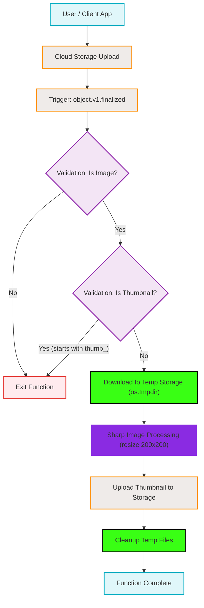

# Image Resizing Cloud Function Deployment Flowchart

This flowchart maps the architecture and execution logic of the `generateThumbnail` Firebase Cloud Function, which resizes images uploaded to Cloud Storage.

## Transition Breakdown

1. **Upload Initiation:** A user or client application uploads a file to the `indii-music-founder.firebasestorage.app` bucket.
2. **Event Trigger:** The upload completion fires the `google.cloud.storage.object.v1.finalized` event, which triggers the `generateThumbnail` Gen 2 Cloud Function.
3. **Validation Gates:** 
   - The function checks the `contentType` to ensure it begins with `image/`.
   - The function checks the filename to ensure it does not begin with `thumb_` (preventing infinite loops where a generated thumbnail triggers another thumbnail).
   - If either validation fails, the function exits early.
4. **Temporary Storage:** The original image is downloaded into the server's temporary directory (`os.tmpdir()`).
5. **Processing:** The `sharp` library processes the temporary file, resizing it to fit within a 200x200 pixel bound while maintaining the aspect ratio (`fit: 'inside'`). Enlargement is prevented (`withoutEnlargement: true`).
6. **Upload:** The newly created thumbnail is uploaded back to the original file's directory path in Cloud Storage, prefixed with `thumb_` and flagged with metadata (`resized: "true"`).
7. **Cleanup & Completion:** Temporary files are unlinked using `fs.unlinkSync` to free memory, and the function successfully completes. Error scenarios also route through the cleanup process to prevent temporary storage leakages.
