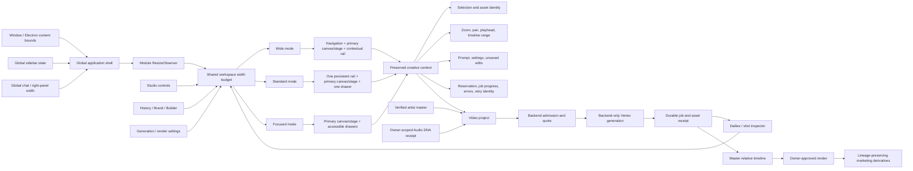
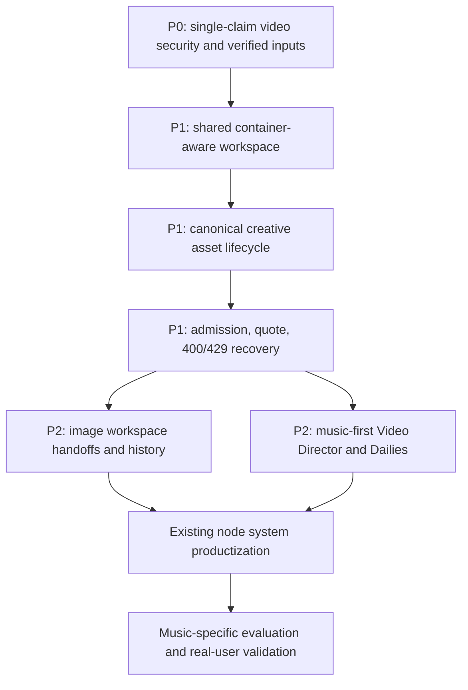

# Image and Video Adaptive Workspace Runtime

**Date:** 2026-07-28
**Scope:** Creative Studio, Video Director, Storyboard, Scene Builder, Editor,
and the existing node workspace.

## Runtime flow

## Layout invariants

1. The module observes its **actual container width**; viewport breakpoints are
   not the authority for internal pane layout.
2. The primary canvas, stage, or timeline keeps a useful minimum width.
   Lower-priority rails collapse into drawers before the primary work surface is
   crushed or covered.
3. Persisted panel preferences are clamped while space is constrained and may
   be restored when space returns.
4. Mode changes never reset the selected asset, canvas transform, playhead,
   prompt, generation settings, operation identity, progress, or unsaved work.
5. Drawers provide a visible trigger, backdrop where appropriate, Escape
   handling, focus containment, and focus return.
6. Pane separators expose accessible values and remain usable at 200% zoom.
7. Generated or native video sound is subordinate to the artist's verified
   master. Auxiliary voiceover or effects remain separate, labeled sources.

## Delivery order

## Verification

- Widths: 2560, 1920, 1440, 1280, 1024, and 768 CSS pixels.
- Zoom: 80%, 100%, 125%, 150%, and 200%.
- Global sidebar and right panel: each open, closed, resized, and restored.
- Internal rails: each open, closed, converted to a drawer, and returned.
- Content states: empty, loading, completed image, playing video, long error,
  approval required, and recoverable 400/429.
- Platforms: browser, Electron maximize/restore/manual resize, and supported
  secondary-window surfaces.
- Assertions: no body-level horizontal scroll, hidden primary action,
  unannounced overlay, undersized primary work surface, or creative-context
  reset.
