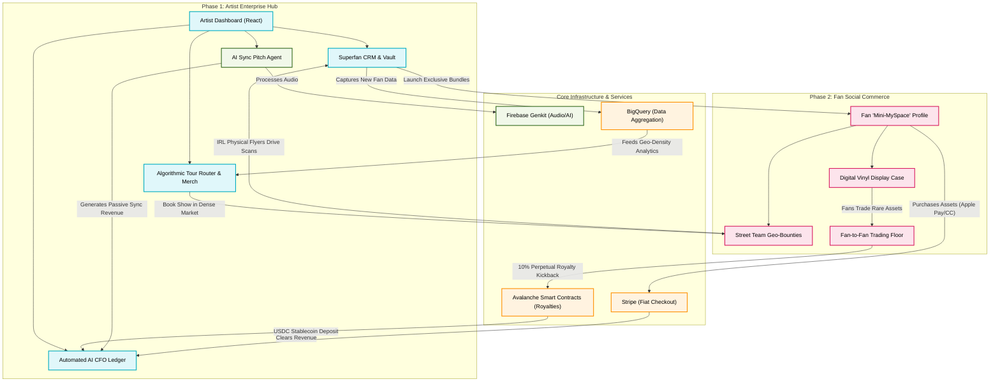

# `indii` Macro Ecosystem Architecture Flowchart

This flowchart visualizes the complete macro-architecture of the `indii` platform. It synthesizes all previous research and feature pillars, connecting the Phase 1 Artist B2B Backend with the Phase 2 Fan B2C Ecosystem to demonstrate the "Closed-Loop Flywheel."

## Transition Breakdown

This is how the entire system functions as a continuous, self-sustaining loop:

1. **The Seed (Phase 1 to Phase 2):** The artist uses the **Superfan CRM** to launch an exclusive "Digital Vinyl" and issues a **Geo-Bounty** mission to fans in a specific city. 
2. **The Social Flex (Phase 2):** Fans complete the mission (putting up IRL flyers) and purchase the Digital Vinyl using standard **Stripe** checkout. The assets are displayed on their public **Fan "Mini-MySpace" Profile**, driving FOMO and status among other fans.
3. **The Data Capture (Infrastructure):** When locals scan the IRL flyers put up by the street team, they are funnelled into the CRM. This demographic data is ingested by **BigQuery**.
4. **The Routing (AI & Analytics):** The **Tour Router** constantly analyzes BigQuery. Seeing a massive spike in Chicago due to the Street Team efforts, it automatically plots a profitable tour date there and predicts the exact physical merch inventory needed.
5. **The Perpetual Kickback (Web3 to CFO):** While the artist is on tour, fans trade the limited Digital Vinyl on the **Secondary Market**. The **Avalanche Smart Contract** intercepts these trades, pushing a 10% perpetual royalty directly into the artist's **AI CFO Ledger** in stablecoins, covering their tour gas and lodging without human intervention.
6. **The Passive Engine:** Concurrently, the **AI Sync Tagger** (powered by Genkit) is autonomously pitching their catalog to music supervisors, ensuring revenue is flowing in even when the artist isn't actively marketing.
