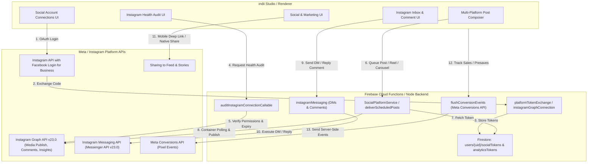

# Instagram Platform Integration Architecture

This diagram illustrates how indii connects to Meta's Instagram Platform APIs across user authentication, media publishing (Feed/Stories/Reels/Carousels), analytics, direct messaging, comment automation, and conversion tracking.

## Architecture Summary

indii integrates with Meta's Instagram Platform APIs (Graph API v23.0 + Messenger API) to provide independent music artists with a complete social operations suite:
- **Authentication & Security**: Secure server-side OAuth exchange storing encrypted tokens in Firestore `users/{uid}/socialTokens/instagram`. Client secrets never touch the browser.
- **Publishing Engine**: Supports Images, Video Reels, Stories, and Multi-item Carousels with asynchronous container polling (`waitForInstagramContainerReady`) before publishing.
- **Direct Messaging & Comment Automation**: Server-side callable functions for sending DMs and replying to post comments directly from indii Studio.
- **Connection Health Auditing**: On-demand permission scope verification (`instagram_basic`, `instagram_content_publish`, `instagram_manage_comments`, `instagram_manage_messages`).
- **Server-Side Conversion Tracking**: Meta Conversions API (CAPI) event dispatching with SHA-256 PII hashing and `event_id` deduplication.

## Transition Breakdown

1. **OAuth Login Initiation (`AuthUI → FBLogin`)**: User triggers Instagram Business / Facebook Login flow from the Social Account Connections UI in indii Studio.
2. **Authorization Code Exchange (`FBLogin → AuthExchange`)**: Meta returns an authorization code to `platformTokenExchange`, which exchanges it server-side for a long-lived page/user access token.
3. **Encrypted Token Persistence (`AuthExchange → TokenStore`)**: Access tokens and connected Instagram Business User ID (`igUserId`) are dual-written to `users/{uid}/socialTokens/instagram` and `users/{uid}/analyticsTokens/instagram`.
4. **Health Audit Request (`HealthUI → HealthAuditService`)**: Client invokes `auditInstagramConnectionCallable` to verify live connection state.
5. **Permission Verification (`HealthAuditService → GraphAPI`)**: Backend queries `GET /v23.0/me/permissions` against Meta Graph API to audit granted vs. missing scopes.
6. **Post Scheduling & Dispatch (`Composer → PublishService`)**: User schedules an Instagram Feed image, Reel, Story, or Carousel post in indii Post Composer.
7. **Token Retrieval (`PublishService → TokenStore`)**: Scheduled post delivery function (`deliverToInstagram`) fetches stored access token and `igUserId`.
8. **Async Container Polling & Publishing (`PublishService → GraphAPI`)**: Backend creates media container (`POST /{ig_user_id}/media`), polls status until `FINISHED`, and publishes (`POST /{ig_user_id}/media_publish`).
9. **Inbox Action Dispatch (`InboxUI → MessagingService`)**: User sends a direct message or replies to a comment in the indii Instagram Inbox UI.
10. **Messenger API Execution (`MessagingService → MessagingAPI`)**: Backend invokes `sendInstagramMessageCallable` or `replyInstagramCommentCallable` targeting Meta Messenger API v23.0 endpoints.
11. **Native Mobile Sharing (`UI → SharingAPI`)**: Deep links and native mobile intent triggers for Instagram Stories and Feed share sheet.
12. **Conversion Event Capture (`Client → CAPI`)**: Client tracks fan presaves, merchandise purchases, or ticket sales.
13. **Server-Side CAPI Event Transmission (`CAPI → MetaCAPI`)**: `flushConversionEvents` transmits hashed fan data and conversion payloads directly to Meta Conversions API (`graph.facebook.com/v23.0/{pixel_id}/events`).
