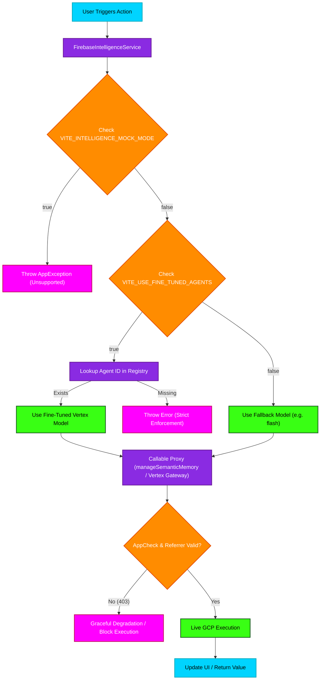

# Intelligence Service & Fine-Tuned Model Resolution Fallback

This flowchart visualizes the logic path for initializing AI models via `FirebaseIntelligenceService` and resolving `FineTunedModel` IDs, particularly handling the `VITE_USE_FINE_TUNED_AGENTS` toggle, the `VITE_INTELLIGENCE_MOCK_MODE` (now explicitly blocked), and fallback logic when the network fails or GCP keys have HTTP referrer blocks.

## Transition Breakdown

1. **Trigger:** A UI action calls the `FirebaseIntelligenceService` for generation, analysis, or memory indexing.
2. **Mock Audit:** The service asserts `VITE_INTELLIGENCE_MOCK_MODE` is strictly `false`. `true` intentionally triggers a terminal `AppException` since live inference is strictly required.
3. **Registry Resolution:** The system checks `VITE_USE_FINE_TUNED_AGENTS`. If `true`, the `FineTunedModel` resolution strict-checks the model registry. Missing agents throw errors immediately instead of silently degrading.
4. **Fallback Handling:** If `USE_FINE_TUNED_AGENTS` is false, it predictably routes to standard production models (e.g., `flash`).
5. **Security Gate:** Calls route through the Firebase functions proxy. AppCheck and Google Cloud API Key HTTP Referrers are evaluated. 403 blocks are caught gracefully, while verified calls succeed and process the live execution.
