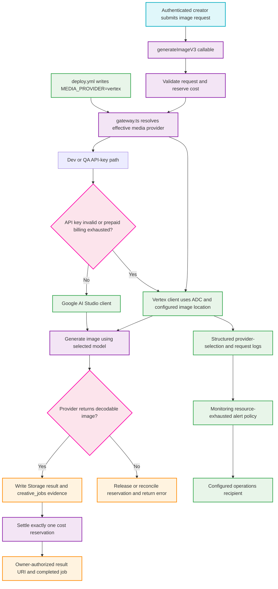

# ISSUE-1082 Vertex rollout flowchart

This map shows the exact production image-generation path and the evidence
needed to close ISSUE-1082 without treating an opaque successful response as
proof of postpaid Vertex usage.

## Transition Breakdown

1. The deployed workflow must explicitly supply `MEDIA_PROVIDER=vertex`; the
   gateway then selects the ADC-backed Vertex client for production requests.
2. A request is validated and its normal cost reservation is created before a
   provider call. The selected model is resolved in `gateway.ts` and is sent
   only to the chosen provider client.
3. The API-key route remains a development and QA path. Only a genuine invalid
   key or prepaid-billing failure may retry through Vertex; production must not
   silently drift to the prepaid provider.
4. A successful response is not acceptance evidence on its own. The callable
   must persist an owner-readable Storage result, a completed `creative_jobs`
   record with the effective provider, and exactly one settled reservation.
5. Vertex initialization and request logs provide the correlated provider
   evidence. Resource-exhausted signals travel through the existing Monitoring
   alert policy to its configured recipient; the acceptance test uses a
   non-production notification test rather than causing a real outage.
6. Any provider or output failure follows the error path: do not claim a
   completed image, and release or reconcile the reservation before returning
   the failure to the caller.
